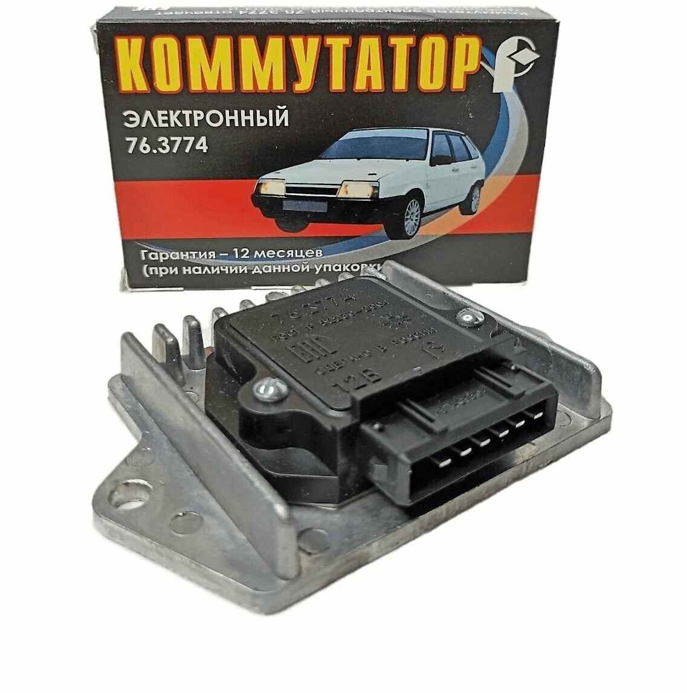
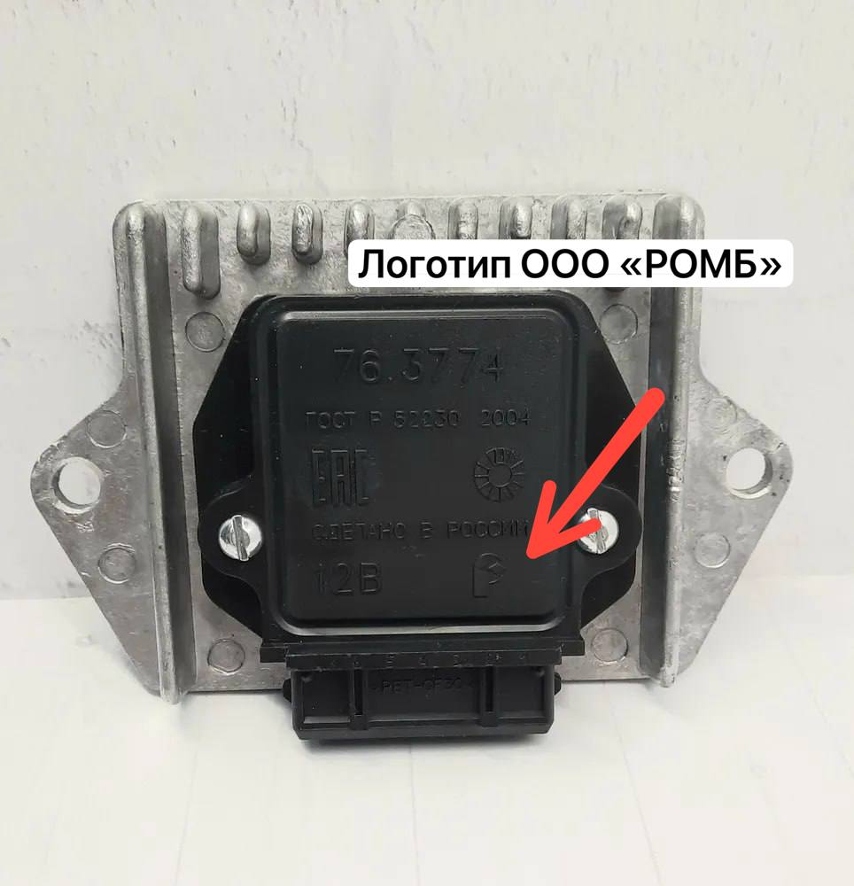

# Коммутатор 76.3774 {#commutator-763774}

{ width="320" }

| Параметр | Значение |
|----------|----------|
| Модель | **76.3774** |
| Производитель | ООО «РОМБ», г. Пенза |
| Каналов | 1 |
| Выводов | 6 |
| Питание | 12 В |

## Назначение {#purpose}

**76.3774** — одноканальный силовой модуль для коммутации первичной обмотки катушки зажигания. Сигнал с [датчика Холла](hall-sensor.md) задаёт момент включения силового ключа; длительность импульса зависит от напряжения бортсети, оборотов и тока в катушке.

У коммутатора ООО «РОМБ» есть внутренний контроллер с обратной связью по току — стабильный заряд катушки по диапазону оборотов и питающего напряжения.

## Подключение {#wiring}

Собирайте цепь по схеме [одноконтурного БСЗ](../theory/single-circuit.md). Тот же коммутатор подходит для [двухконтурной](../theory/dual-circuit.md) схемы ([wasted spark](https://en.wikipedia.org/wiki/Wasted_spark_system)) и [четырёхконтурной](../theory/four-circuit.md) для V8.

## Подлинность РОМБ {#romb-authenticity}

{ width="360" }

*Отличительный знак на корпусе.*

Проверенный поставщик **76.3774** — ООО «РОМБ», Пенза (часто говорят «коммутатор от ВАЗ 2108»). На оригинале — эмблема в правом нижнем углу; на подделках её обычно нет.

## Ссылки по схемам {#schematic-links}

- [Одноконтурное БСЗ](../theory/single-circuit.md)
- [Двухконтурное БСЗ](../theory/dual-circuit.md)
- [Четырёхконтурное БСЗ](../theory/four-circuit.md)
