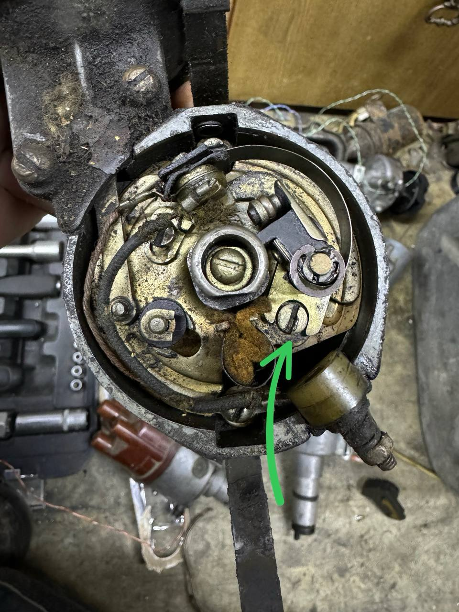

# Распределитель Р-114

Распространённый трамблёр на ЗАЗ и ЛуАЗ. С начала 1980-х его сменил распределитель **17.3706**.

## Внешний вид

{ width="480" }

*Рис. 1. Внешний вид.*

Р-114 (в т.ч. Р-114Б и др. индексы) — на рис. 1.

### Обозначение модели

- На ранних экземплярах — табличка, модель в левом нижнем углу.
- На более поздних — клеймо по кругу снизу корпуса, рядом с надписью ГОСТ.

## Отличия внутри

{ width="480" }

*Рис. 2. Вид площадки.*

Отличительный признак — **регулировочный винт** плавной подстройки зазора контактной пары.

Комплект БСЗ под этот трамблёр: [ЗАЗ / ЛуАЗ — одноконтурный набор под Р-114](../kits/zaz-luaz.md).
