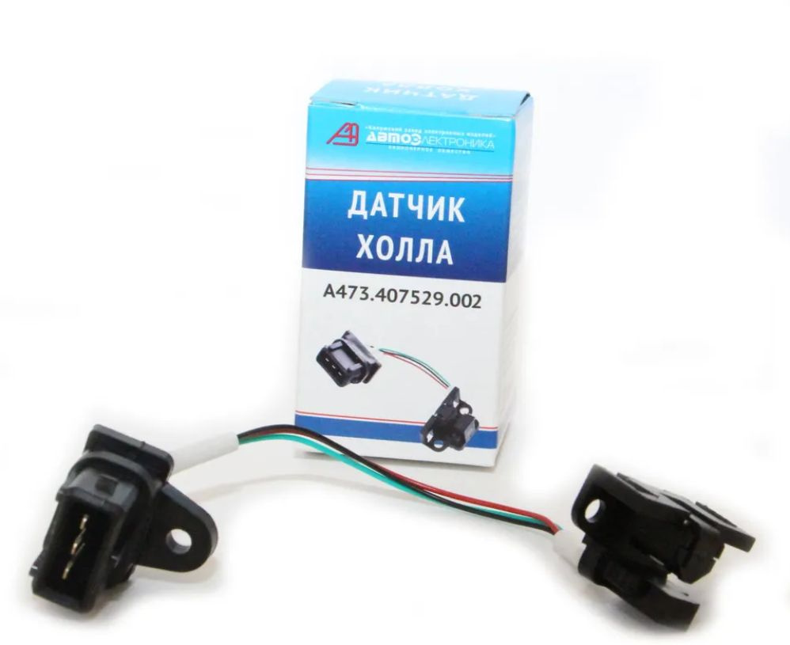
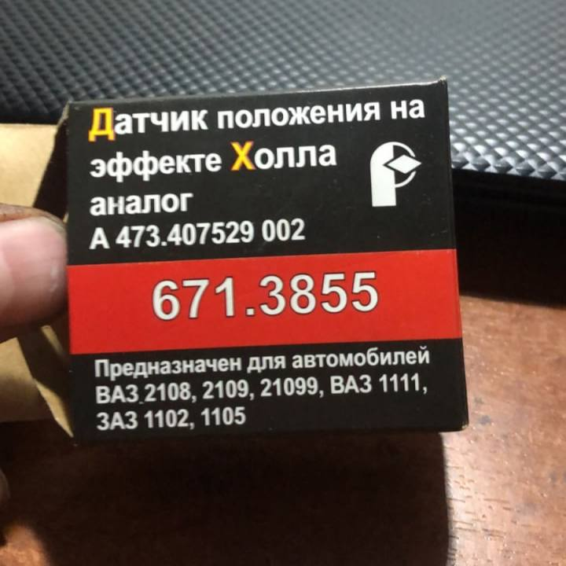
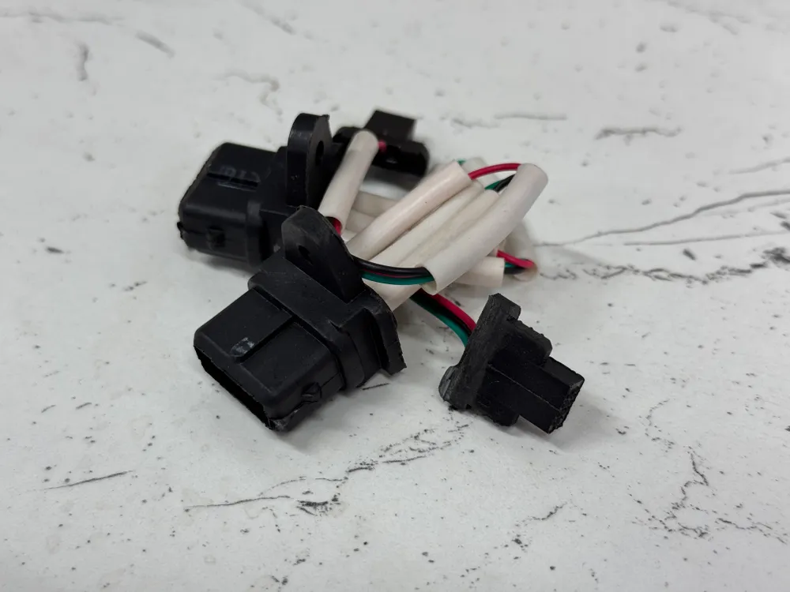

# Датчик Холла ВАЗ 2108

{ width="400" }

| Параметр | Значение |
|----------|----------|
| Модель | **А473.407529.002** |
| Производитель | АО «Автоэлектроника» |
| Каналов | 1 |
| Выводов | 3 |
| Питание | 12 В |

## Описание

Датчик основан на [эффекте Холла](https://ru.wikipedia.org/wiki/%D0%AD%D1%84%D1%84%D0%B5%D0%BA%D1%82_%D0%A5%D0%BE%D0%BB%D0%BB%D0%B0)[^hall]. Подробнее о приборе: [Википедия — датчик Холла](https://ru.wikipedia.org/wiki/%D0%94%D0%B0%D1%82%D1%87%D0%B8%D0%BA_%D1%8D%D1%84%D1%84%D0%B5%D0%BA%D1%82%D0%B0_%D0%A5%D0%BE%D0%BB%D0%BB%D0%B0).

Обычно внутри стоит схема с [компаратором](https://ru.wikipedia.org/wiki/%D0%9A%D0%BE%D0%BC%D0%BF%D0%B0%D1%80%D0%B0%D1%82%D0%BE%D1%80)[^comp], формирующим логический «0»/«1» при пересечении порога.

[^hall]: [Эффект Холла](https://ru.wikipedia.org/wiki/%D0%AD%D1%84%D1%84%D0%B5%D0%BA%D1%82_%D0%A5%D0%BE%D0%BB%D0%BB%D0%B0)
[^comp]: [Компаратор](https://ru.wikipedia.org/wiki/%D0%9A%D0%BE%D0%BC%D0%BF%D0%B0%D1%80%D0%B0%D1%82%D0%BE%D1%80)

## Роль датчика в зажигании

*Формирование импульсов в трамблёре с БСЗ Неодим.*

В трамблёре датчик — **цифровой триггер** для [коммутатора 76.3774](commutator-763774.md).

**Заводская схема:** у датчика свой магнит, напротив — зазор; ферромагнитная «шторка» на валу экранирует поле.

**Неодим:** наоборот — на валу [втулка с неодимовыми магнитами](https://ru.wikipedia.org/wiki/%D0%9D%D0%B5%D0%BE%D0%B4%D0%B8%D0%BC%D0%BE%D0%B2%D1%8B%D0%B9_%D0%BC%D0%B0%D0%B3%D0%BD%D0%B8%D1%82)[^nd], датчик реагирует на проход магнитов.

[^nd]: [Неодимовый магнит](https://ru.wikipedia.org/wiki/%D0%9D%D0%B5%D0%BE%D0%B4%D0%B8%D0%BC%D0%BE%D0%B2%D1%8B%D0%B9_%D0%BC%D0%B0%D0%B3%D0%BD%D0%B8%D1%82)

1. Втулка с магнитами вращается с валом трамблёра.
2. При сближении магнита: поле достаточной силы → импульс на коммутатор.
3. При удалении: поле падает → окончание фронта сигнала.

### Особенности датчиков ВАЗ

- **Инверсная логика:** наличие поля у датчика → низкий уровень сигнала (~0 В); отсутствие поля → ~+12 В (уточняйте по описанию на ваш комплект датчик + коммутатор).
- **Однополярное срабатывание** — чувствителен к одному полюсу магнита.
- **Разные производители:** АО «Автоэлектроника» — как правило «прямая» полярность магнитной части; у части аналогов (например ООО «РОМБ») — обратная.

## Полярность магнитов

{ width="420" }

*Магнит с доработанного датчика должен **отталкиваться** от внешней стороны втулки.*

У АО «Автоэлектроника» — условно **прямая** полярность; наши комплекты из коробки под неё. Отпиленный магнит с датчика отталкивается от внешней стороны втулки → одноимённые полюса.

{ width="420" }

**671.3855** и аналоги с **обратной** полярностью «из коробки» могут не видеть магниты втулки. На втулках Неодим под магнитами есть отверстие **⌀ 1,5 мм** — можно перевернуть магниты и согласовать полярность.

!!! tip "Инструмент"
    Удобно вынимать магниты шестигранником **1,5 мм**.

### Как проверить полярность

1. Поднесите отпиленный магнит к внешней стороне втулки — должен **отталкиваться** (одинаковые полюса). Пошаговая доработка — в [видео ниже](#vk-hall-sensor-video).
2. На собранной БСЗ: на центральный ВВ-провод — свеча на надёжную «массу», зажигание ВКЛ, крутить трамблёр за хвостовик — на каждом цилиндре должна быть искра, когда магнит напротив датчика.

!!! warning "Медленное вращение"
    У части коммутаторов есть фильтр по низкой частоте: при очень медленном вращении импульсов может не быть. Крутите **рывками**, прогоняя каждый магнит мимо датчика.

Если полярность втулки верна, а искры нет — см. [алгоритм проверки БСЗ](../service/bsz-check-algorithm.md).

## Рекомендации для комплектов «Неодим»

Рекомендуем **А473.407529.002** с одним «ушком» разъёма (ВАЗ 2108).

!!! note "Зазор"
    Оптимально **1,0…2,0 мм** (±1,0 мм). Прямоугольные неодимовые магниты в комплектах допускают чуть больший зазор.

При нестандартном датчике с обратной полярностью переверните магниты во втулке. Критерий: отпиленный магнит отталкивается от внешней стороны втулки.

### Готовые датчики для наборов Неодим {#neodim-hall-kits}

Готовые доработанные датчики и наборы по 2 шт. — витрина продавца [Ozon — Неодим](https://www.ozon.ru/seller/neodim-1649379/).

#### Одноконтурный комплект (1 шт.)

{ width="360" }

| Параметр | Значение |
|----------|----------|
| Совместимость | ЗАЗ / ЛуАЗ / Иж / АЗЛК / Москвич (одноконтурные киты) |
| Ozon | [готовый датчик](https://ozon.ru/product/1896862674) |
| SKU | **1896862674** |
| Артикул поиска | **[Neodim_hs_1](https://www.ozon.ru/search/?text=Neodim_hs_1)** |
| База | А473.407529.002 |

Либо любой магазинный датчик **А473.407529.002** и доработка по [видео ниже](#vk-hall-sensor-video).

#### Двухконтурный комплект (2 шт.)

{ width="360" }

| Параметр | Значение |
|----------|----------|
| Совместимость | ЗАЗ / ЛуАЗ / Иж / АЗЛК / Москвич / ГАЗ / УАЗ (двухконтурные киты) |
| Ozon | [готовые датчики, 2 шт.](https://ozon.ru/product/1896873304) |
| SKU | **1896873304** |
| Артикул поиска | **[Neodim_hs_2](https://www.ozon.ru/search/?text=Neodim_hs_2)** |
| База | А473.407529.002 |

Или два магазинных датчика с самостоятельной доработкой — см. [видео](#vk-hall-sensor-video).

## Видео: доработка датчика {#vk-hall-sensor-video}

--8<-- "snippets/vk-hall-sensor-mod.md"
