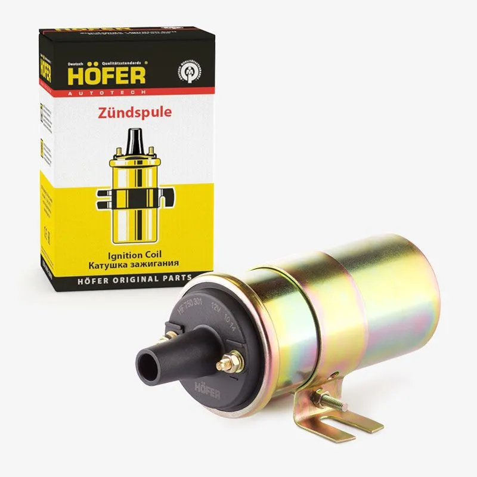
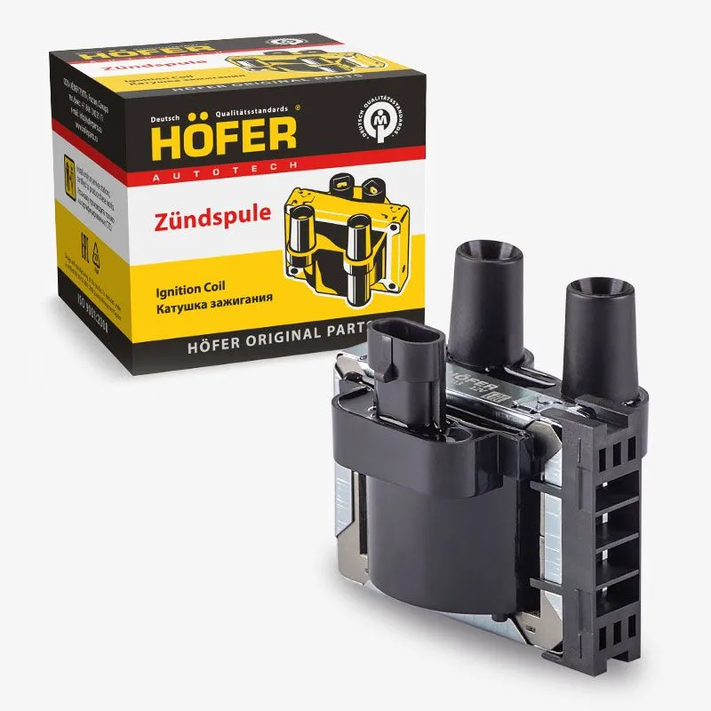
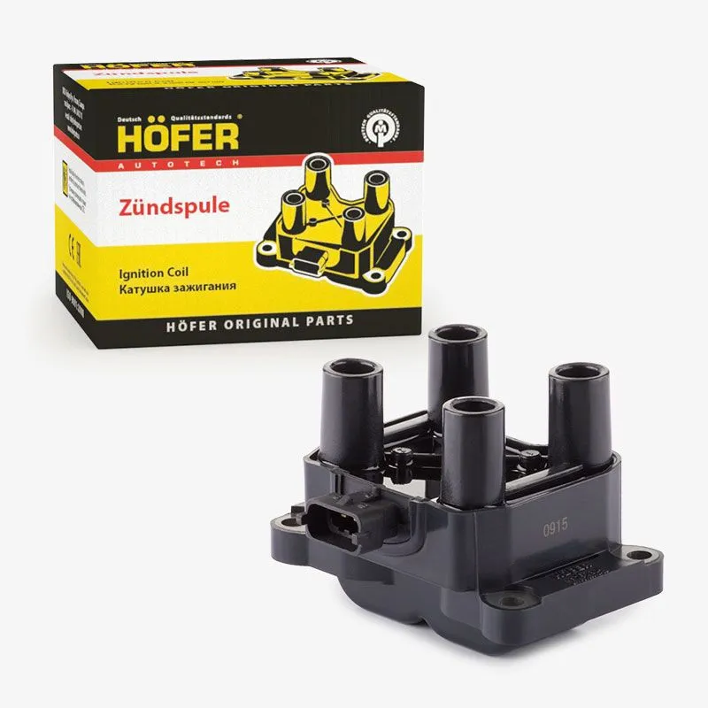

# Катушки зажигания

## Одноконтурная система зажигания

1 шт. **HOFER HF 750 301**

{ width="360" }

## Двухконтурная система зажигания

2 шт. **HOFER HF750313**

{ width="360" }

**Либо** 1 шт. **HOFER HF750304**

{ width="360" }

## Четырёхконтурная система зажигания

4 шт. **HOFER HF750313**

{ width="360" }
