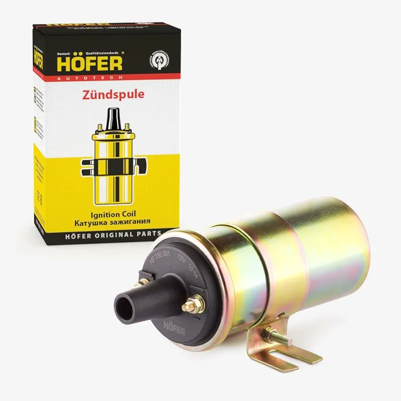
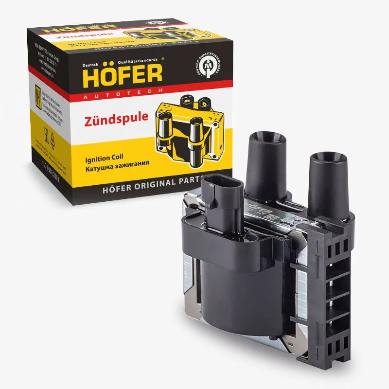
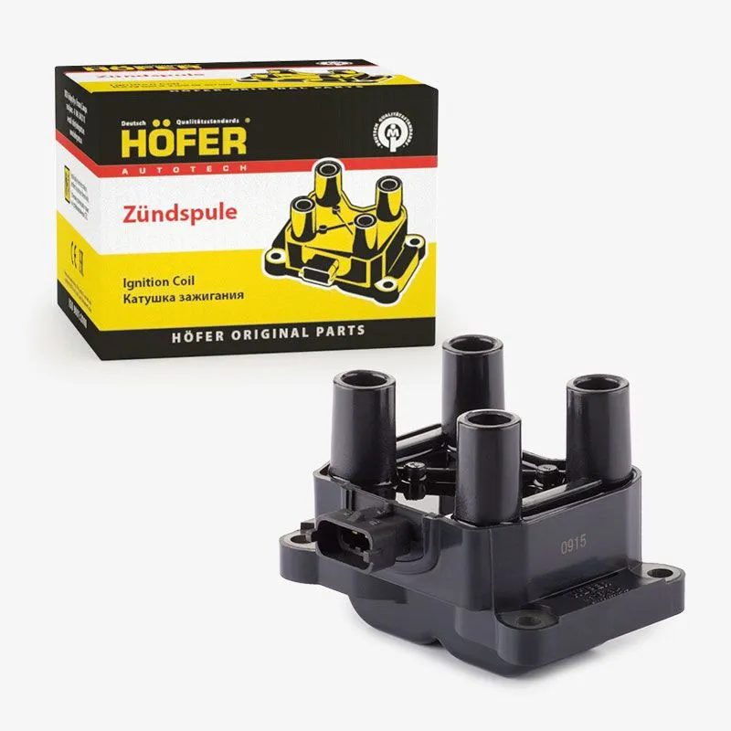

# Катушки зажигания {#ignition-coils}

## Одноконтурная система зажигания {#coils-single-circuit}

1 шт. **HOFER HF 750 301**

{ width="360" }

## Двухконтурная система зажигания {#coils-dual-circuit}

2 шт. **HOFER HF750313**

{ width="360" }

**Либо** 1 шт. **HOFER HF750304**

{ width="360" }

## Четырёхконтурная система зажигания {#coils-four-circuit}

4 шт. **HOFER HF750313**

{ width="360" }

## Смотрите также {#see-also}

- [Типовой список компонентов](buy-list.md).
- [Жгут проводки БСЗ](wiring-harness-dbsz.md) — разъём модуля ВАЗ 2111.
- [Коммутатор 76.3774](commutator-763774.md) — управление первичкой.
- [Теория БСЗ](guide/theory.md) — какая схема вам подходит.
