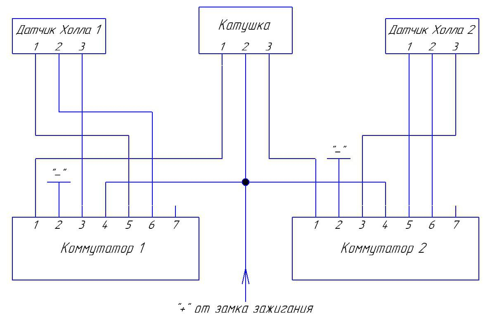
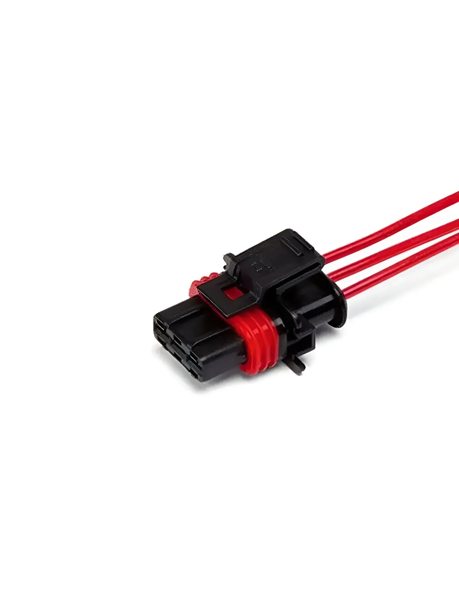
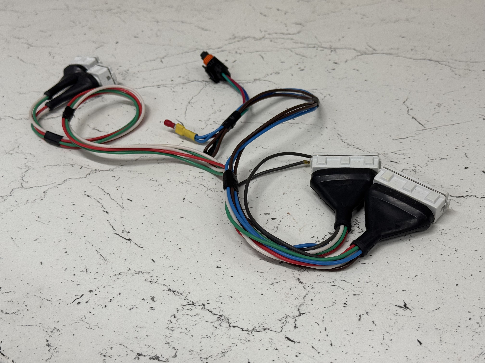

# Жгут проводки БСЗ

## Самодельный жгут (два контура)

Жгут для схемы с **двумя коммутаторами** и **одной общей катушкой** изготавливается **самостоятельно** из **двух** готовых жгутов ВАЗ 2105. Ориентир по соединениям — схема ниже.

{ width="720" }

При использовании **модуля зажигания ВАЗ 2111** к разъёму катушки удобно подойдёт соответствующий разъём для модуля зажигания ВАЗ 2111 (также такие разъемы встречаются в жгуте индивидуальных катушек в инжекторных ВАЗ Приора, Веста):

{ width="420" }

!!! info "Подключение четырехконтурного зажигания"
    Для четырехконтурной системы зажигания делается по аналогичной схеме, просто увеличивается количество жгутов для подключения.

## Готовый жгут 
Готовый жгут для подключения двухконтурного БСЗ Неодим с катушкой **ВАЗ 2111** на базе проводки классики **2105 / 2107**.

{ width="360" }

| Параметр | Значение |
|----------|----------|
| Назначение | Двухконтурная система Неодим, катушка ВАЗ 2111, база проводки классика 2105/2107 |
| Ozon | [карточка товара](https://ozon.ru/product/1845914359) |
| SKU | **1845914359** |
| Артикул поиска | **[Neodim_prov_dbsz_std2105](https://www.ozon.ru/search/?text=Neodim_prov_dbsz_std2105)** |
