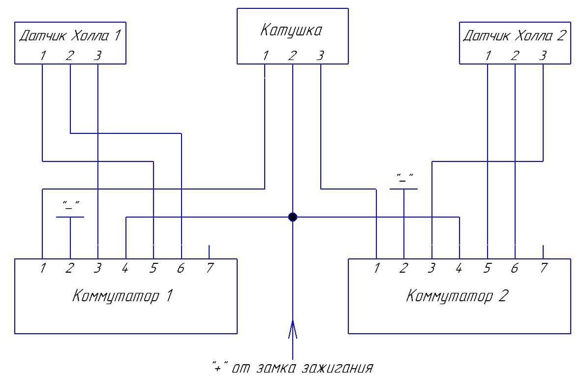
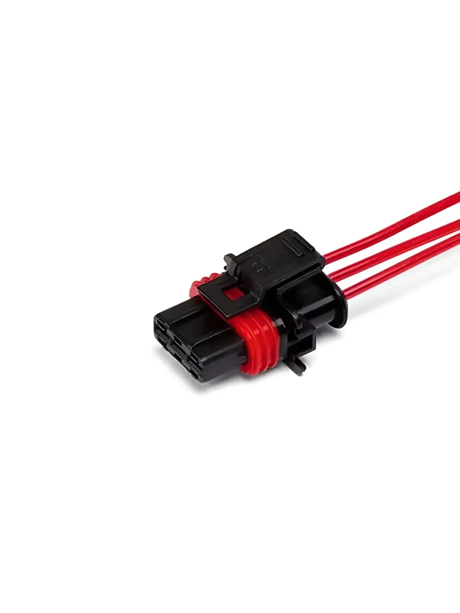
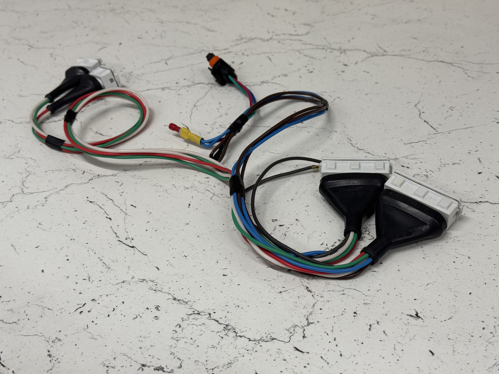

# Жгут проводки БСЗ {#wiring-harness-bsz}

## Самодельный жгут (два контура) {#diy-harness-two-circuits}

Жгут для схемы с **двумя коммутаторами** и **одной общей катушкой** изготавливается **самостоятельно** из **двух** готовых жгутов ВАЗ 2105. Ориентир по соединениям — схема ниже.

{ width="720" }

При использовании **модуля зажигания ВАЗ 2111** к разъёму катушки удобно подойдёт соответствующий разъём для модуля зажигания ВАЗ 2111 (также такие разъемы встречаются в жгуте индивидуальных катушек в инжекторных ВАЗ Приора, Веста):

{ width="420" }

!!! info "Подключение четырехконтурного зажигания"
    Для четырехконтурной системы зажигания делается по аналогичной схеме, просто увеличивается количество жгутов для подключения.

## Готовый жгут {#ready-made-harness}
Готовый жгут для подключения двухконтурного БСЗ Неодим с катушкой **ВАЗ 2111** на базе проводки классики **2105 / 2107**.

{ width="360" }

| Параметр | Значение |
|----------|----------|
| Назначение | Двухконтурная система Неодим, катушка ВАЗ 2111, база проводки классика 2105/2107 |
| Ozon | [карточка товара](https://ozon.ru/product/1845914359) |
| SKU | **1845914359** |
| Артикул поиска | **[Neodim_prov_dbsz_std2105](https://www.ozon.ru/search/?text=Neodim_prov_dbsz_std2105)** |

## Смотрите также {#see-also}

- [Типовой список компонентов](buy-list.md).
- [Коммутатор 76.3774](commutator-763774.md) · [Катушки зажигания](ignition-coils.md).
- [Двухконтурное БСЗ](../guide/schemes/dual-circuit.md) · [Четырёхконтурное БСЗ](../guide/schemes/four-circuit.md).
- [Руководство → Алгоритм проверки БСЗ → разъёмы](../guide/bsz-check-algorithm.md#vaz-2105-2121-harness-connectors).
