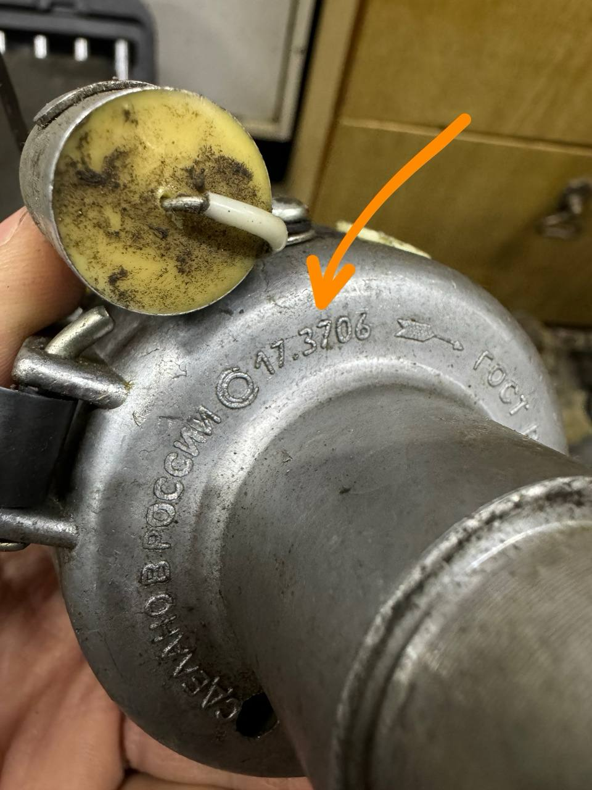
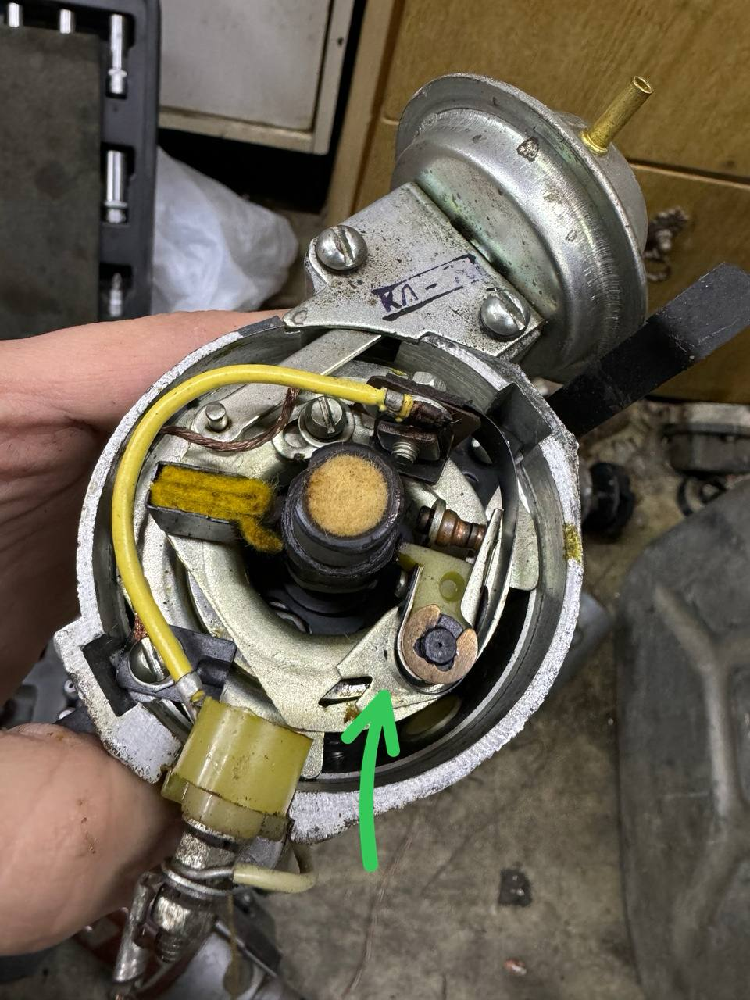

# Распределитель 17.3706 {#distributor-173706}

Распространённый контактный трамблёр ЗАЗ / ЛуАЗ, логическая замена семейству [Р-107, Р-118, Р-114](distributor-r114.md) с начала 1980-х.

Комплекты Неодим: [ЗАЗ / ЛуАЗ](../kits/zaz-luaz.md).

## Идентификация по клейму {#id-by-stamping}

{ width="480" }

*Рис. 1. На корпусе снизу (или сбоку) нанесена маркировка **17.3706**.*

## Ориентир внутри {#inside-reference}

{ width="480" }

*Рис. 2. Внутри корпуса — ориентир на площадке прерывателя (на фото указано стрелкой): сверяйтесь с ним при разборке и установке элементов переделки.*
