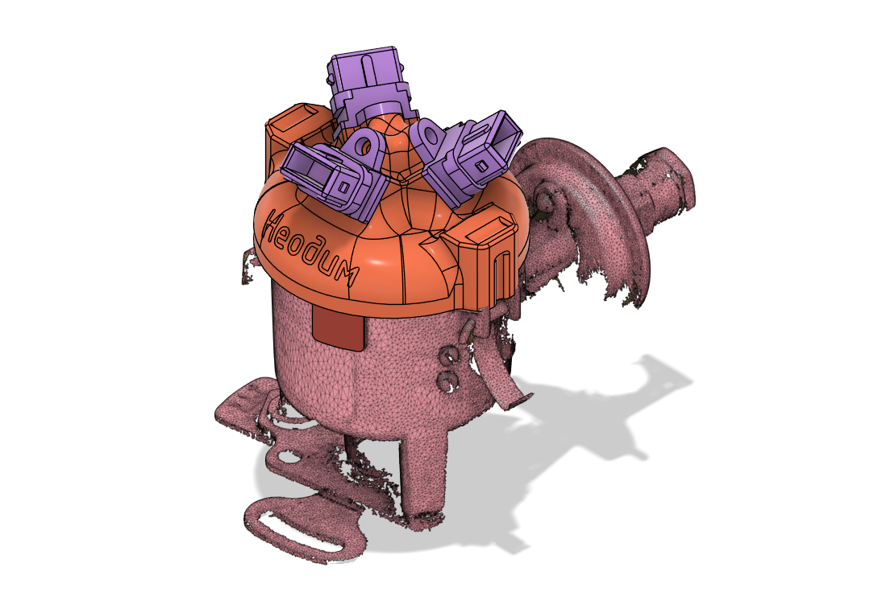
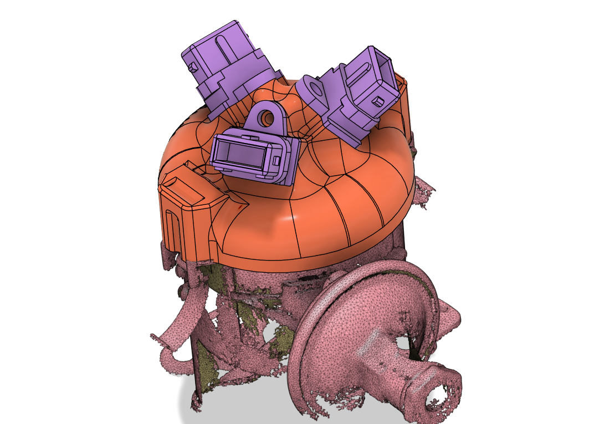

# Распределители 23.3706 и 2301.3706 {#distributors-233706-2301}

Контактные распределители зажигания **6 цилиндров** линейки **ГАЗ-51**, **ГАЗ-52** и ряда согласованных модификаций. На корпусе встречается маркировка **23.3706** либо **2301.3706** — это та же линейка трамблёров, ориентируйтесь на фактическую маркировку вашего экземпляра перед заказом комплекта.

Трёхконтурные комплекты БСЗ Неодим для этой линейки: [ГАЗ (6 цил.) — комплекты БСЗ](../kits/gaz-v6.md).

## Внешний вид (3D-модель) {#distributor-233706-appearance}

Сборка трамблёра с крышкой Неодим под трёхконтурное БСЗ:

{ width="480" }

Крышка распределителя:

{ width="480" }

## Смотрите также {#see-also}

- [ГАЗ (6 цил.) — комплекты БСЗ](../kits/gaz-v6.md).
- [Трёхконтурное БСЗ](../theory/three-circuit.md) — принципиальная схема для 6 цилиндров.
- [1908.3706, 3312.3706](distributor-1908-3312.md) — 4-цилиндровые ГАЗ / УАЗ.
- [Как определить необходимый комплект БСЗ](../kits/how-to-choose-kit.md).
