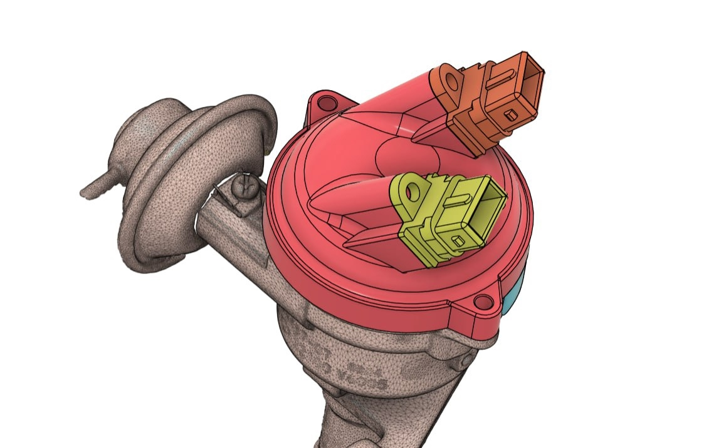
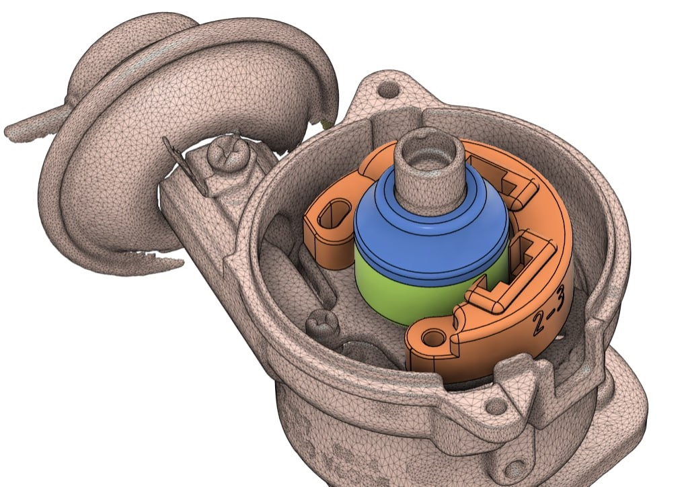

# Распределитель D4R87-07 {#distributor-d4r87-07}

Трамблёр распределителя зажигания маркировки **D4R87-07** применялся на двигателе **CA20S** (в т.ч. **Nissan Gloria VNY30**). Для его перевода на бесконтактное зажигание разработан **двухконтурный** комплект БСЗ Неодим.

Полное описание набора, материалов и схемы подключения: [Nissan Gloria VNY30, CA20S](../kits/nissan.md#gloria-vny30-d4r).

{ width="480" }

{ width="480" }
