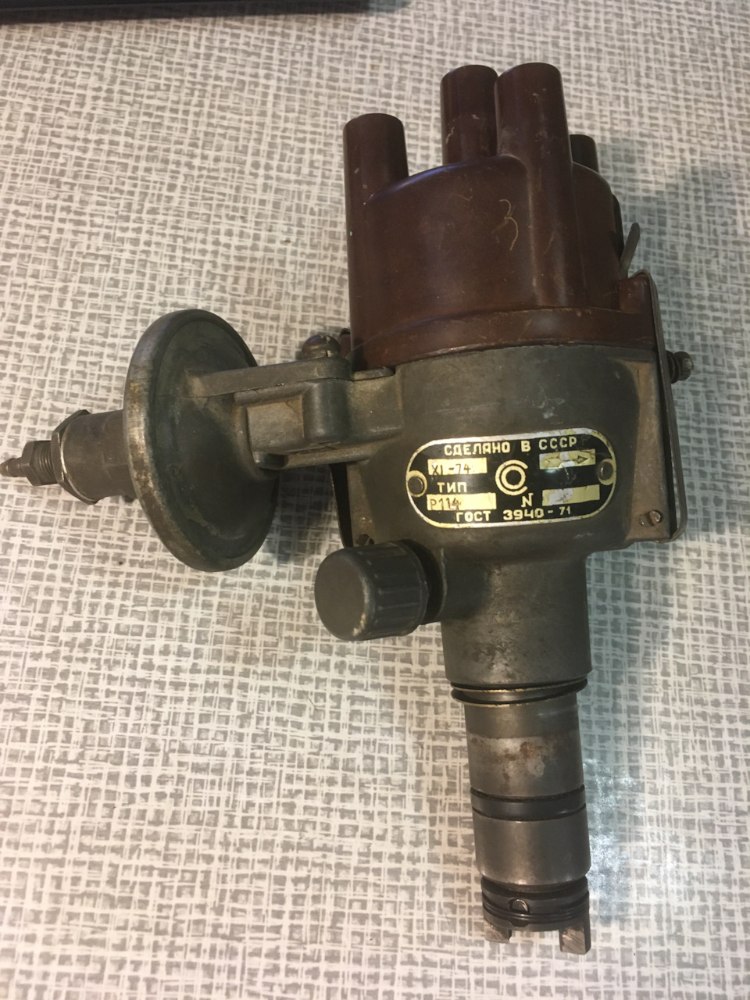
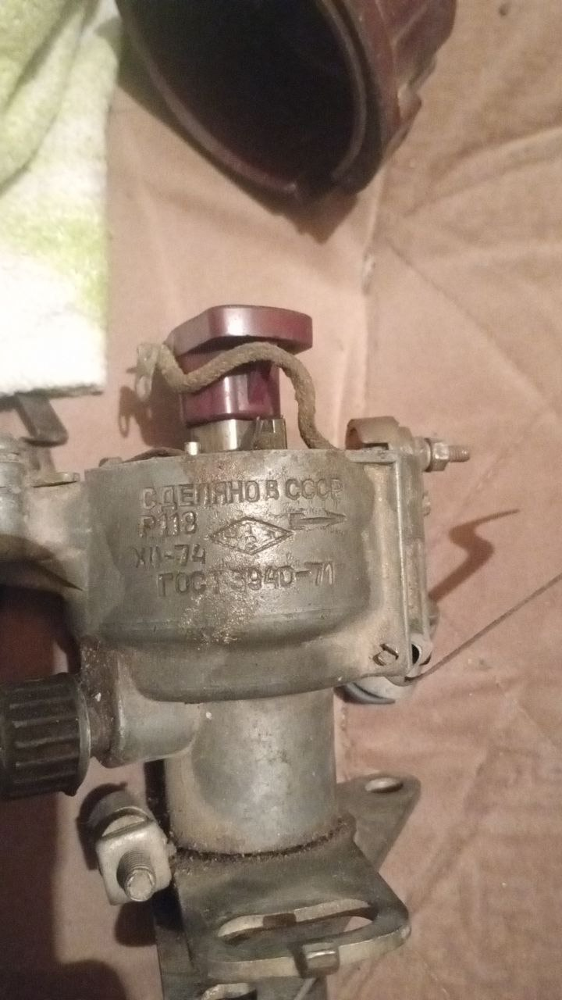

# Распределители Р-107, Р-118, Р-114 {#distributors-r107-r118-r114}

Контактные трамблёры семейства **Р-107**, **Р-118**, **Р-114** на ЗАЗ и ЛуАЗ. Одноконтурные комплекты Неодим под эту линейку — см. [ЗАЗ / ЛуАЗ — одноконтурный набор](../kits/zaz-luaz.md). С начала 1980-х **Р-114** в массе заменён распределителем **17.3706** — см. [17.3706](distributor-173706.md).

Р-114 (в т.ч. Р-114Б и др. индексы) рассматривается ниже как основной представитель семейства для идентификации и внутреннего устройства.

## Внешний вид {#external-appearance}

{ width="480" }

*Рис. 1. Внешний вид.*

### Обозначение модели {#model-marking}

- На ранних экземплярах — табличка, модель в левом нижнем углу.
- На более поздних — клеймо по кругу снизу корпуса, рядом с надписью ГОСТ.

## Отличия внутри {#internal-differences}

{ width="480" }

*Рис. 2. Вид площадки.*

Отличительный признак — **регулировочный винт** плавной подстройки зазора контактной пары.

## Р-118 {#distributor-r118}

{ width="480" }

*Рис. 3. Пример клейма модели Р-118.*

Перед заказом комплекта **обязательно сравните площадку (основание контактной группы)** с узлом **Р-114**: на практике встречаются трамблёры, где после ремонта или перестановки стоит площадка от другой модели — без визуального сравнения с эталоном Р-114 легко ошибиться с посадкой деталей набора.

Материал по деталям распределителей этого семейства будет дополнен.
