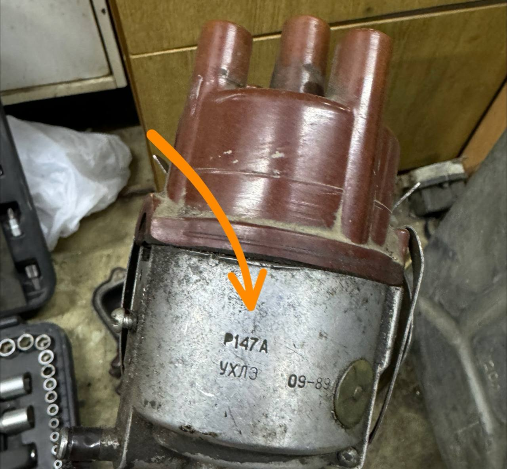

# Распределитель Р-147 {#distributor-r147}

Трамблёр линейки Иж / Москвич / АЗЛК. Комплекты Неодим V2 COMBO совместно с [4701.3706](distributor-47013706.md) и [4708.3706](distributor-47083706.md): [Иж / Москвич / АЗЛК](../kits/izh-moskvich-azlk.md).

## Идентификация по корпусу {#id-by-housing}

{ width="480" }

*Рис. 1. На металлическом корпусе под крышкой обычно клеймо вида **Р-147**, **Р147А** и заводские обозначения — ориентируйтесь на штамп.*
