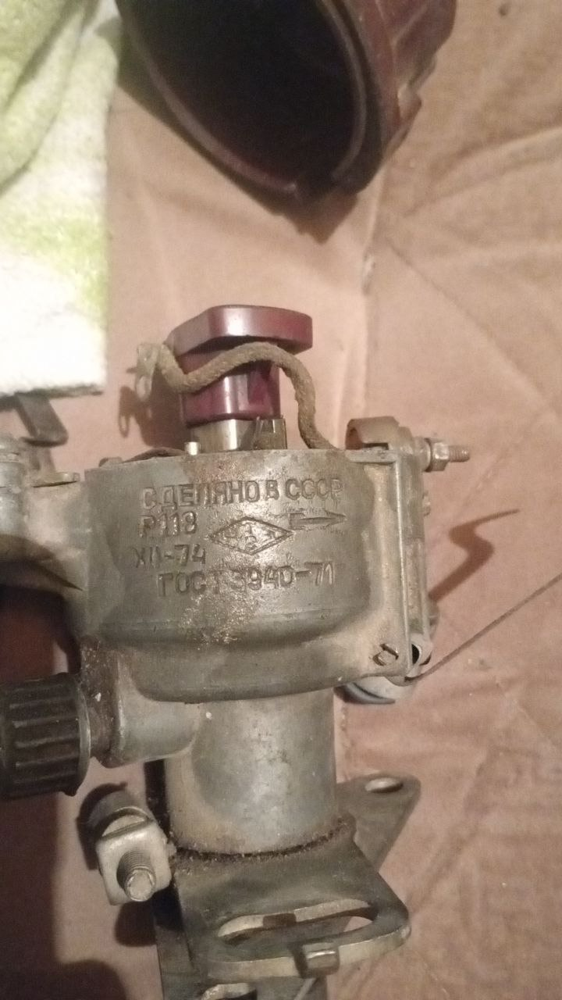
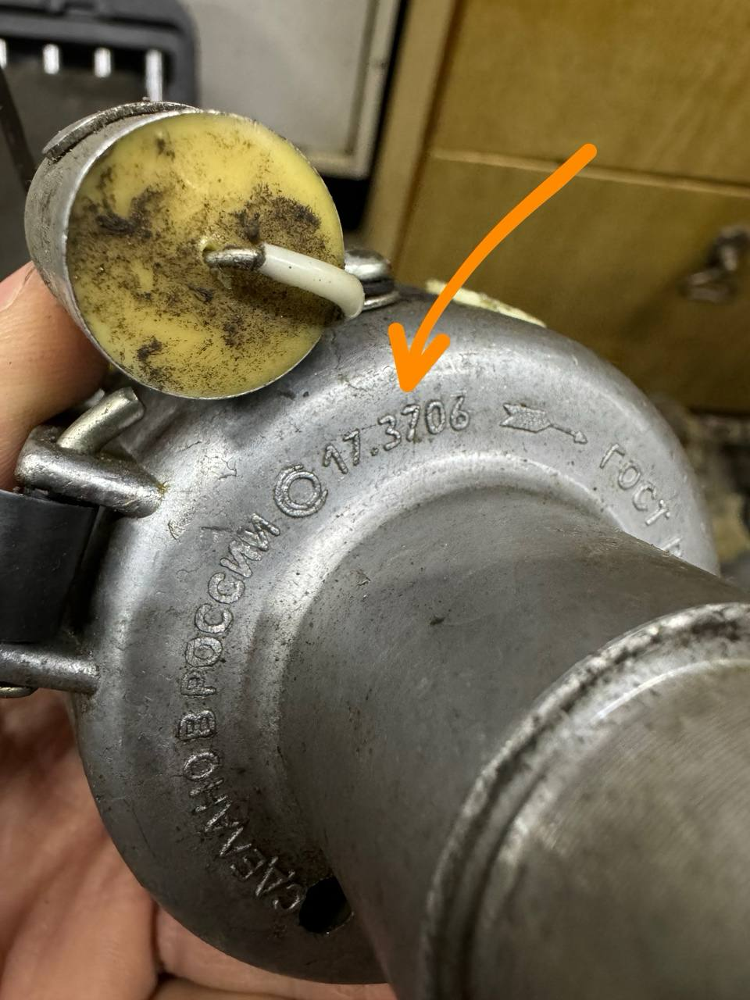

# Неодим БСЗ — бесконтактное зажигание для вашего трамблёра {#neodim-bsz-home}

Переделка контактного трамблёра в **бесконтактную систему зажигания (БСЗ)** с сохранением заводских характеристик угла опережения зажигания (УОЗ) — готовые комплекты под переделку популярных моделей трамблеров.

<a class="md-button md-button--primary" href="kits/how-to-choose-kit/">Подобрать комплект</a>

<a class="md-button" href="guide/">С чего начать</a>

<a class="md-button" href="contact/">Остались вопросы?</a>

## Как это работает {#how-it-works}

Путь от определения трамблёра до работающего двигателя — семь шагов:

-   :material-numeric-1-circle: **[Определите свой трамблёр](distributors/index.md)**

    Маркировка на корпусе в формате **(модель).3706**.

-   :material-numeric-2-circle: **[Выберите комплект Неодим](kits/index.md)**

    По модели авто или по трамблёру; покупка на Ozon.

-   :material-numeric-3-circle: **[Соберите список покупок](components/buy-list.md)**

    Датчик, коммутатор, катушка, жгут — по числу контуров.

-   :material-numeric-4-circle: **[Изучите схему сборки](guide/build-circuit.md)**

    Типовая электрическая схема вашего типа системы.

-   :material-numeric-5-circle: **[Видео-инструкции](videos/index.md)**

    Установка комплектов на реальных моторах и доработка датчика Холла.

-   :material-numeric-6-circle: **[Проверьте систему](guide/bsz-check-algorithm.md)**

    Чеклист: датчик, полярность магнитов, искра; настройка УОЗ.

-   :material-numeric-7-circle: **[Что-то не так?](guide/problems-and-solutions.md)**

    Типовые неисправности и их решения.

## Определите свой трамблёр {#find-your-distributor}

Маркировка обычно нанесена **снизу** на корпусе (иногда — на боковой табличке):

{ width="360" }

{ width="360" }

Сверьте цифры с таблицей всех моделей: [Распределители зажигания](distributors/index.md). Не уверены в своей модели — [напишите нам](contact.md), определим вместе.

## Компоненты для сборки системы {#components-for-build}

Комплект под сам трамблёр производит Неодим, остальное докупается в магазинах автозапчастей или на [Ozon](https://www.ozon.ru/). Количество зависит от числа контуров — вкладки в [типовом списке для сборки БСЗ](components/buy-list.md):

-   :material-magnet: **[Датчик Холла](components/hall-sensor.md)**

    От ВАЗ 2108 — «картридж», замена без покупки нового набора.

-   :material-chip: **[Коммутатор 76.3774](components/commutator-763774.md)**

    РОМБ, один на каждый контур.

-   :material-flash: **[Катушки зажигания](components/ignition-coils.md)**

    Стандартная катушка, модуль ВАЗ 2111, ЗМЗ 406.

-   :material-power-plug: **[Жгут проводки БСЗ](components/wiring-harness-dbsz.md)**

    ВАЗ 2105 / 2121 — по нужной длине.

-   :material-cart-arrow-down: **[Типовой список для сборки](components/buy-list.md)**

    Полный перечень покупок по типу вашей системы.

## Проверка и настройка {#check-and-tune}

-   :material-check-decagram-outline: **[Алгоритм проверки БСЗ](guide/bsz-check-algorithm.md)**

    Пошаговый чеклист: датчик, полярность, коммутатор, жгут.

-   :material-tune-variant: **[Настройка момента зажигания](guide/ignition-timing.md)**

    Выставление УОЗ с МД-1 и мультиметром.

-   :material-magnet-on: **[Доработка датчика Холла](guide/hall-sensor-mod.md)**

    Подготовка заводского датчика ВАЗ 2108 под комплекты Неодим.

-   :material-gauge: **[Подключение тахометра](guide/tachometer-connection.md)**

    Развязывающие диоды для систем с двумя контурами.

## Что-то не так? {#troubleshooting}

Полярность магнитов, зазор, рассинхрон, проводка — типовые неисправности собраны в одном месте:

<a class="md-button md-button--primary" href="guide/problems-and-solutions/">Решить проблему</a>

## Новости сообщества ВКонтакте {#vk-community-news}

--8<-- "snippets/vk-group-news-widget.md"

## Остались вопросы? {#still-have-questions}

Поможем подобрать комплект, разобраться со схемой или решить проблему. Быстрее всего — в личные сообщения **группы ВКонтакте** или в Telegram-чат проекта:

<a class="md-button md-button--primary" href="https://vk.com/club220578116" target="_blank" rel="noopener">Группа ВКонтакте</a>

<a class="md-button" href="https://t.me/bszkit_chat" target="_blank" rel="noopener">Telegram-чат</a>

<a class="md-button" href="contact/">Все контакты</a>

--8<-- "snippets/vk-contact-us-widget.md"

Не нашли комплект под свой трамблёр — напишите нам, мы можем разработать набор для вашей модели.

## О проекте {#about-project}

Проект переделывает контактные распределители (трамблёры) в бесконтактные системы зажигания с сохранением заводских характеристик угла опережения. Все комплекты рассчитаны на распространённый [датчик Холла от ВАЗ 2108](components/hall-sensor.md): при выходе из строя достаточно заменить «картридж», новый набор покупать не нужно. Подробнее о схемах — в статье [Теория БСЗ](guide/theory.md).
