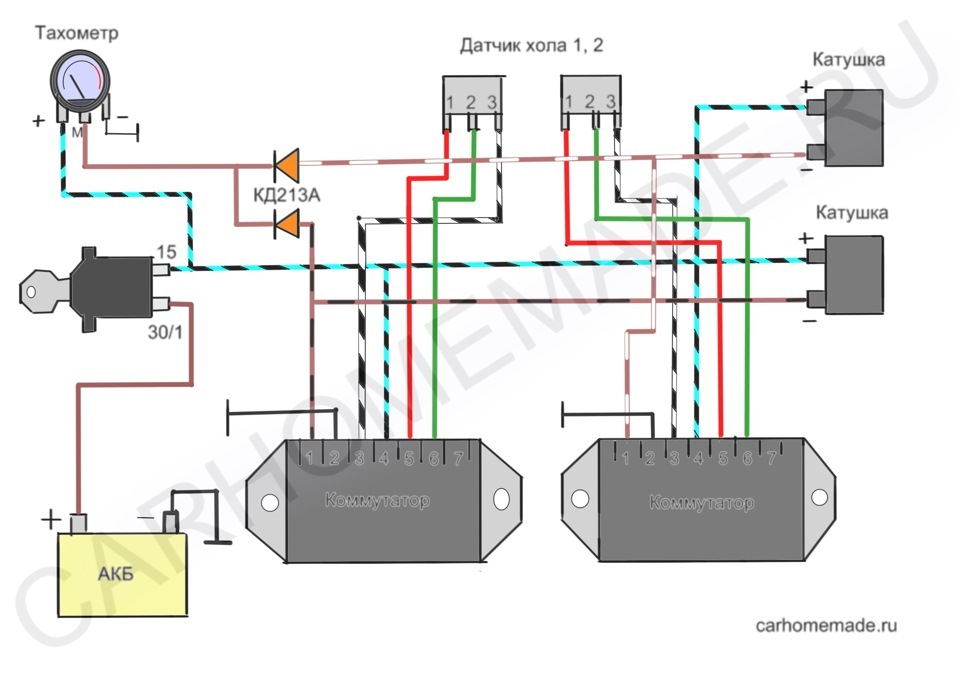
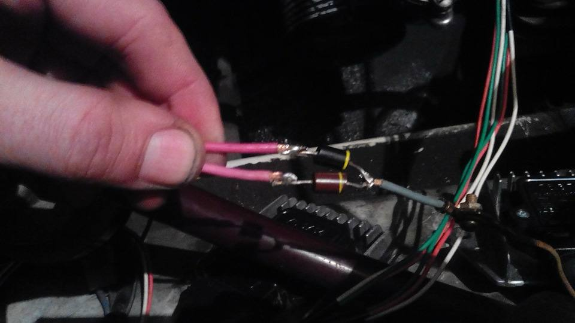
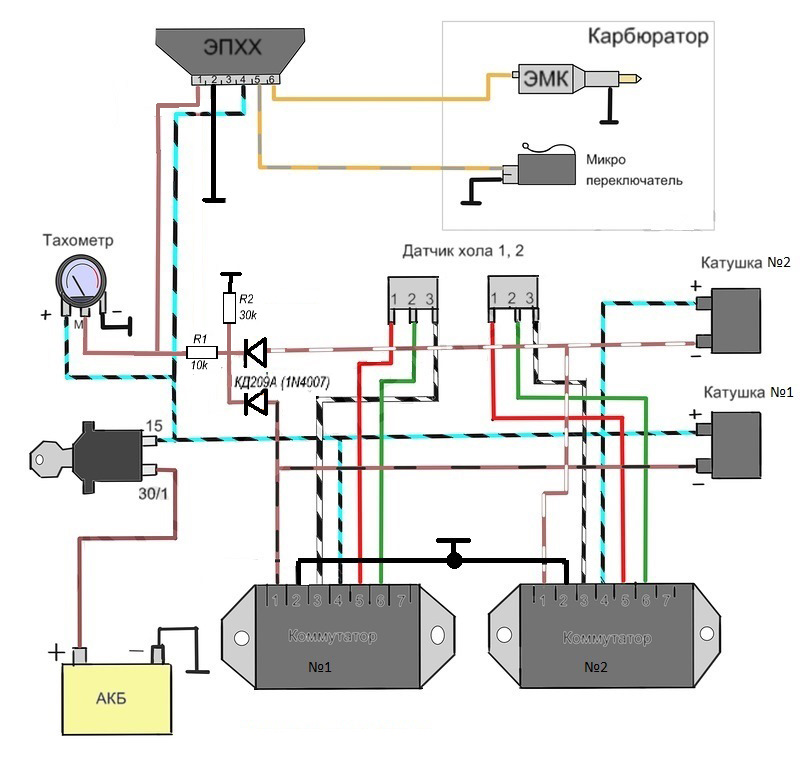

# Подключение тахометра (два контура)

В [двухконтурном БСЗ](../theory/dual-circuit.md) два независимых канала зажигания: два коммутатора и две первичные цепи (две катушки или модуль на две катушки). Типовой штатный тахометр рассчитан на один вход импульсов с «минуса» первичной цепи или с выхода одного коммутатора. Чтобы не соединять электрически два контура между собой, импульсы с обоих коммутаторов подают на вход **M** тахометра через развязывающие диоды («диодное ИЛИ»): каждый диод берёт сигнал со своего контура, на общем катоде — суммарная последовательность импульсов для прибора.

## Базовая схема: только диоды

Фрагмент цепи (как на жгуте или отдельной врезке):

{ width="720" }

Полная принципиальная схема включения тахометра, замка зажигания, двух коммутаторов, двух датчиков Холла и двух катушек:

{ width="720" }

**Диоды:** в качестве развязки рекомендуем выпрямительные диоды **1N4007** (или аналог с запасом по обратному напряжению и току для цепи первичной обмотки зажигания).

!!! warning "Полярность диодов обязательна"
    Подключайте строго как на схеме: **анод** к выходу соответствующего коммутатора (линии с первичной обмоткой катушки), **катоды** двух диодов соединяются вместе и идут дальше на вход **M** тахометра. Перепутать направление нельзя — прибор может не работать или цепь поведёт себя некорректно.

## Если по схеме только с диодами тахометр ведёт себя плохо

Некоторые модели тахометров неустойчиво считают импульсы или дают ошибку по шкале при одной только диодной развязке. Тогда пробуют вариант **с резисторами** по схеме ниже (номиналы на рисунке — ориентир из практики; точная работа зависит от конкретной модели прибора).

{ width="720" }

Имеет смысл переходить на эту схему, если при корректной полярности диодов и исправной обводке тахометр **плохо показывает** (дрожит стрелка, сильное занижение или завышение оборотов, пропадание показаний на части диапазона). **Поведение зависит от модели тахометра** — универсального «списка подходящих» нет.

## См. также

- [Двухконтурное БСЗ](../theory/dual-circuit.md)
- [Коммутатор 76.3774](../components/commutator-763774.md)
