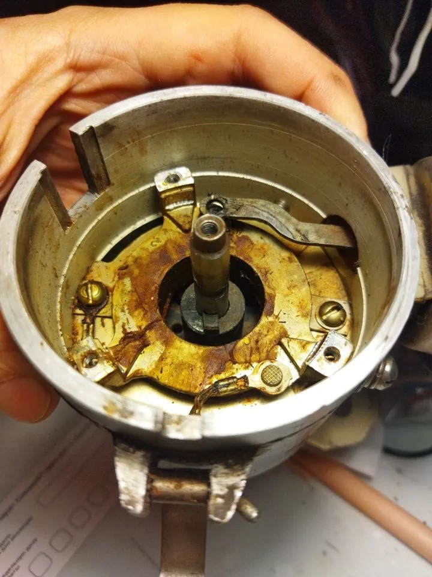
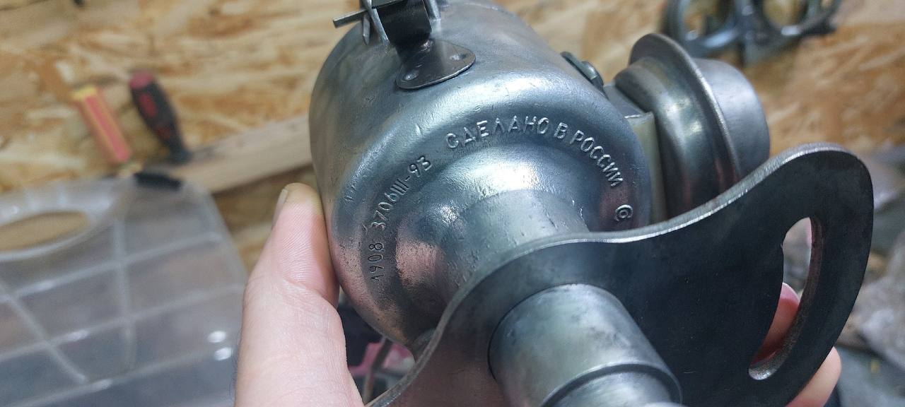
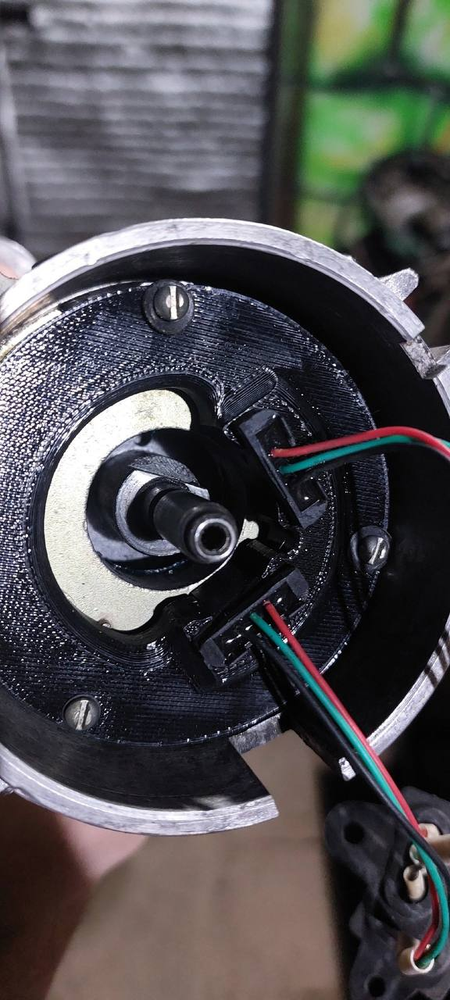
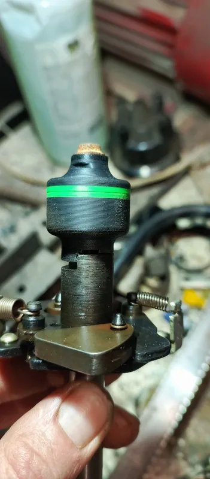
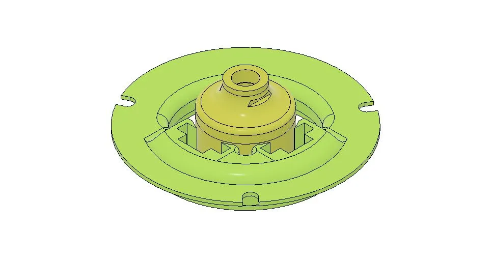
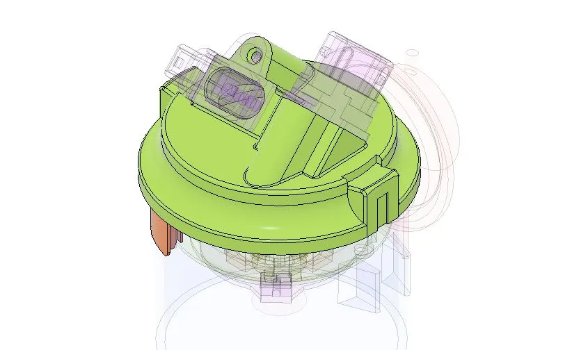
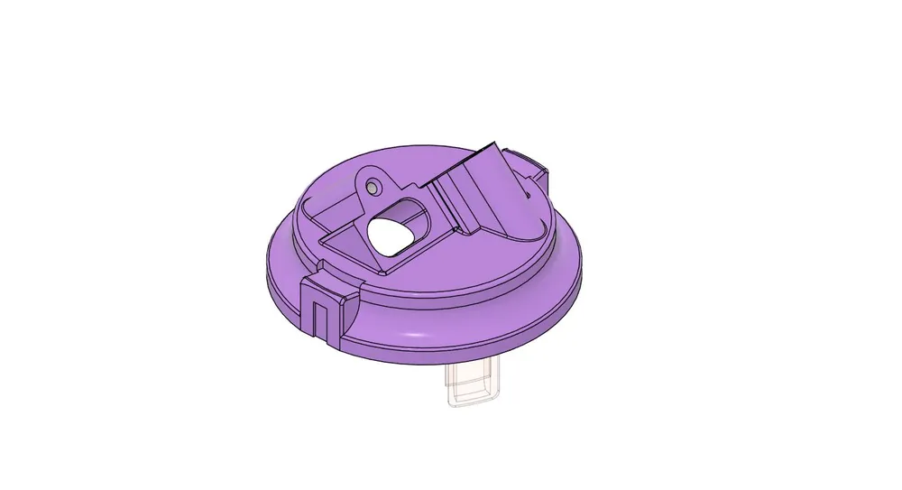

# ГАЗ / УАЗ — комплекты БСЗ Неодим {#kits-gaz-uaz}

## Двухконтурная система {#dual-circuit-system}

Схема и обоснование: [Двухконтурное БСЗ](../theory/dual-circuit.md).

## Трамблёр: новый и старый образец (1908.3706, 3312.3706) {#distributor-1908-3312-new-old}

Трамблёры **ГАЗ / УАЗ** (ЗМЗ, УМЗ) с распределителями **1908.3706** и **3312.3706**: маркировка корпуса, фото валов и пошаговые нюансы — в отдельной статье [Распределители 1908.3706 и 3312.3706](../distributors/distributor-1908-3312.md).

Наборы изначально рассчитаны на трамблёры **нового** образца (массовый выпуск с ~2000 г., встречаются, например, изделия **Пекар**). Перед заказом **обязательно** сверьте тип вала с фото и описанием по ссылке выше.

### Новый образец (~2000 г. и новее) {#distributor-new-sample-2000}

На валу — посадочный **выступ** под штатную геометрию втулки набора. Дополнительная доработка втулки не нужна.

{ width="480" }

### Старый образец 1908.3706 {#distributor-old-sample-1908}

У **старого** образца другая маркировка на корпусе; на валу — **одна лыска (скос)** вместо выступа «нового» типа. Такие экземпляры встречаются реже, но перед заказом лучше проверить.

{ width="480" }

{ width="480" }

**Если у вас старый трамблёр:**

1. Доработать втулку: сточить **более широкий** из выступов, чтобы втулка заняла положение на валу; при необходимости подогнать посадку надфилем (см. иллюстрацию ниже).
2. Либо заменить на распределитель **нового** образца — предпочтительно: без правок втулки и с меньшим риском износа механики у старого трамблера.

{ width="480" }

---

## Комплекты {#kits-section}

### «Стандарт» (1908.3706, 3312.3706) {#kit-standard-1908-3312}

{ width="360" }

| Параметр | Значение |
|----------|----------|
| Распределители | 1908.3706, 3312.3706 |
| Ozon | [карточка товара](https://ozon.ru/product/1638091781) |
| SKU | **1638091781** |
| Артикул поиска | **[Neodim_dbsz_1908](https://www.ozon.ru/search/?text=Neodim_dbsz_1908)** |
| Версия | **v1** |
| Материал | ABS |

### «COMBO» {#kit-combo-1908}

{ width="360" }

| Параметр | Значение |
|----------|----------|
| Распределители | 1908.3706, 3312.3706 |
| Ozon | [карточка товара](https://ozon.ru/product/1903934961) |
| SKU | **1903934961** |
| Артикул поиска | **[Neodim_dbsz_1908_C](https://www.ozon.ru/search/?text=Neodim_dbsz_1908_C)** |
| Версия | **v1** |
| Материал | ABS + ASA+CF |

Отличие от «Стандарт» — пластик **ASA+CF** с карбоновой фиброй: лучше УФ-стойкость, температура и химстойкость; для машин с повышенными нагрузками.

## Дополнения {#extras}

### Крышка под два разъёма (стандарт) {#cover-two-connectors-standard}

{ width="360" }

| Параметр | Значение |
|----------|----------|
| Распределители | 1908.3706, 3312.3706 |
| Ozon | [карточка товара](https://ozon.ru/product/1638101167) |
| SKU | **1638101167** |
| Артикул поиска | **[Neodim_cvr_1908](https://www.ozon.ru/search/?text=Neodim_cvr_1908)** |
| Версия | **v1** |
| Материал | ABS |

Крышка с посадочными местами под разъёмы [датчиков Холла](../components/hall-sensor.md) ВАЗ 2108 (одно «ухо»). Необязательна, если дорабатываете штатную крышку.

### Крышка CARBON {#cover-carbon}

{ width="360" }

| Параметр | Значение |
|----------|----------|
| Распределители | 1908.3706, 3312.3706 |
| Ozon | [карточка товара](https://ozon.ru/product/1933033868) |
| SKU | **1933033868** |
| Артикул поиска | **[Neodim_cvr_1908_crbn](https://www.ozon.ru/search/?text=Neodim_cvr_1908_crbn)** |
| Версия | **v1** |
| Материал | ASA+CF |

Повышенная стойкость к УФ, температуре и химии по сравнению с ABS-версией.

---

## Видео {#videos-section}

### Установка комплекта {#kit-installation-video}

--8<-- "snippets/vk-install-gaz-uaz.md"

Видео и пошаговая доработка датчика: [Датчик Холла](../components/hall-sensor.md#vk-hall-sensor-video).
