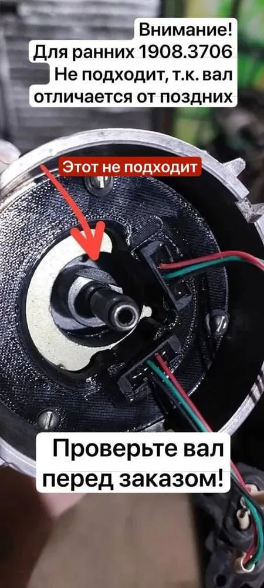
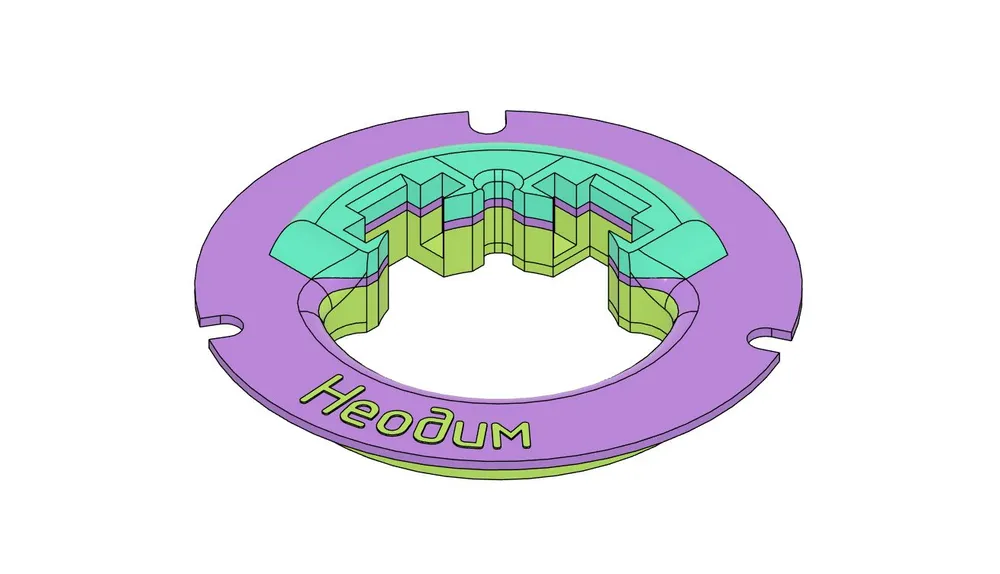

# ГАЗ / УАЗ — комплекты БСЗ Неодим

## Двухконтурная система

Схема и обоснование: [Двухконтурное БСЗ](../theory/dual-circuit.md).

Наборы рассчитаны на трамблёры **нового** образца (выпуск с ~2000 г.). Перед заказом сверьте тип вала.

### Распределитель старого образца

{ width="400" }

У старого образца вал с **одним скосом**; такие трамблёры редки, но убедитесь, что втулка садится только одной стороной (выступ со смещением относительно оси симметрии).

**Если у вас старый трамблёр:**

1. Доработать втулку (спилить более широкий выступ, подогнать посадку надфилем).
2. Либо заменить на распределитель нового образца — предпочтительно: без правок втулки и с меньшим риском износа механики.

!!! note "Подсказка по видео"
    Тип вала хорошо виден в видеоинструкции по установке комплекта внизу страницы.

### Комплект «Стандарт» (1908.3706, 3312.3706)

{ width="360" }

| Параметр | Значение |
|----------|----------|
| Распределители | 1908.3706, 3312.3706 |
| Ozon | [карточка товара](https://ozon.ru/product/1638091781) |
| Артикул поиска | **[Neodim_dbsz_1908](https://www.ozon.ru/search/?text=Neodim_dbsz_1908)** |
| Версия | **v1** |
| Материал | ABS |

Прямоугольные магниты — по опыту предыдущих поколений наборов.

### Комплект «COMBO»

{ width="360" }

| Параметр | Значение |
|----------|----------|
| Распределители | 1908.3706, 3312.3706 |
| Ozon | [карточка товара](https://ozon.ru/product/1903934961) |
| Артикул поиска | **[Neodim_dbsz_1908_C](https://www.ozon.ru/search/?text=Neodim_dbsz_1908_C)** |
| Версия | **v1** |
| Материал | ABS + ASA+CF |

Отличие от «Стандарт» — пластик **ASA+CF** с углём: лучше УФ-стойкость, температура и химстойкость; для машин с повышенными нагрузками.

## Дополнения

### Крышка под два разъёма (стандарт)

{ width="360" }

| Параметр | Значение |
|----------|----------|
| Распределители | 1908.3706, 3312.3706 |
| Ozon | [карточка товара](https://ozon.ru/product/1638101167) |
| Артикул поиска | **[Neodim_cvr_1908](https://www.ozon.ru/search/?text=Neodim_cvr_1908)** |
| Версия | **v1** |
| Материал | ABS |

Крышка с посадочными местами под разъёмы [датчиков Холла](../components/hall-sensor.md) ВАЗ 2108 (одно «ухо»). Необязательна, если дорабатываете штатную крышку.

### Крышка CARBON

{ width="360" }

| Параметр | Значение |
|----------|----------|
| Распределители | 1908.3706, 3312.3706 |
| Ozon | [карточка товара](https://ozon.ru/product/1933033868) |
| Артикул поиска | **[Neodim_cvr_1908_crbn](https://www.ozon.ru/search/?text=Neodim_cvr_1908_crbn)** |
| Версия | **v1** |
| Материал | ASA+CF |

Повышенная стойкость к УФ, температуре и химии по сравнению с ABS-версией.

### Датчики Холла (2 шт.)

{ width="360" }

| Параметр | Значение |
|----------|----------|
| Ozon | [готовые датчики](https://ozon.ru/product/1896873304) |
| Артикул поиска | **[Neodim_hs_2](https://www.ozon.ru/search/?text=Neodim_hs_2)** |
| База | А473.407529.002 |

Или два [датчика Холла](../components/hall-sensor.md) с самостоятельной доработкой — видео ниже.

---

## Сообщество

--8<-- "snippets/telegram-bsz.md"

## Видео

### Установка комплекта

--8<-- "snippets/vk-install-gaz-uaz.md"

### Доработка датчика Холла

Самостоятельная подготовка заводского [датчика Холла](../components/hall-sensor.md) ВАЗ 2108:

--8<-- "snippets/vk-hall-sensor-mod.md"
