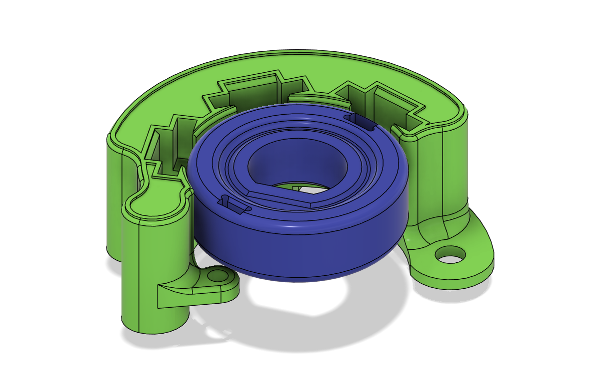
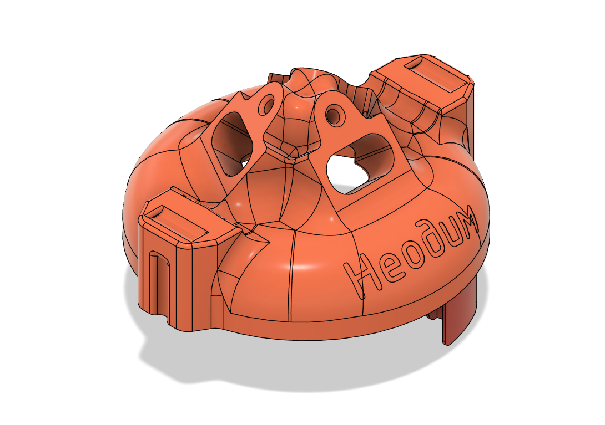

# ГАЗ (6 цил.) — комплекты БСЗ Неодим {#kits-gaz-v6}

Комплекты **трёхконтурного** бесконтактного зажигания для контактных трамблёров маркировки **23.3706** и **2301.3706** (в т.ч. **ГАЗ-51**, **ГАЗ-52** и согласованные модификации). Перед заказом сверьте маркировку на корпусе распределителя — см. [Распределители 23.3706 и 2301.3706](distributors/distributor-233706-2301.md).

## Трёхконтурная система {#triple-circuit-system}

Три независимых контура на шесть цилиндров: на каждую пару цилиндров один контур по тому же принципу, что и [двухконтурное БСЗ](guide/schemes/dual-circuit.md) — рабочая и «холостая» искра. Подробнее об идее — [трёхконтурное БСЗ](guide/schemes/three-circuit.md); обоснование двухконтурной схемы см. в статье про двухконтурное зажигание. Для данного трамблёра контуров три (три пары цилиндров).

## Набор для переделки распределителя зажигания {#kit-gaz-v6-conversion}

{ width="360" }

| Параметр | Значение |
|----------|----------|
| Распределители | 23.3706, 2301.3706 |
| Ozon | [карточка товара](https://ozon.ru/product/3801503899) |
| SKU | **3801503899** |

## Крышка для распределителя зажигания {#kit-gaz-v6-cover}

{ width="360" }

| Параметр | Значение |
|----------|----------|
| Распределители | 23.3706, 2301.3706 |
| Ozon | [карточка товара](https://ozon.ru/product/3801497674) |
| SKU | **3801497674** |

Точные комплектации и состав комплектов — на карточках Ozon; при необходимости уточняйте по характеристикам товара.

---

## Видео: доработка датчика Холла {#video-hall-sensor-mod}

--8<-- "snippets/vk-hall-sensor-mod.md"

Датчик Холла ВАЗ 2108 — типовой для переделки контактного трамблёра под БСЗ. [Датчик Холла](components/hall-sensor.md) · [инструкция](guide/hall-sensor-mod.md)

## Смотрите также {#see-also}

- [Распределители 23.3706, 2301.3706](distributors/distributor-233706-2301.md).
- [Трёхконтурное БСЗ](guide/schemes/three-circuit.md) · [Двухконтурное БСЗ](guide/schemes/dual-circuit.md).
- [Типовой список компонентов → трёхконтурная система](components/buy-list.md#parts-three-circuit).
- [Руководство → Сборка, проверка, настройка](guide/build-circuit.md).
- [Видео-архив](videos/index.md).
