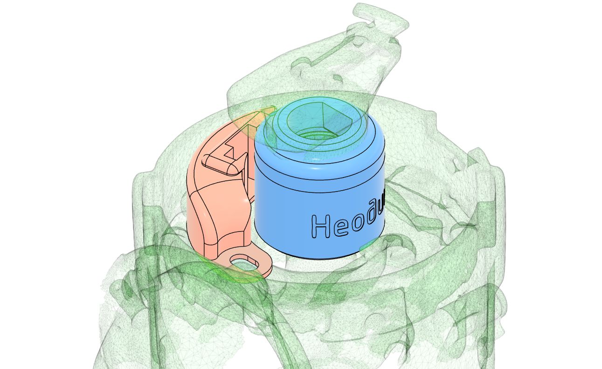
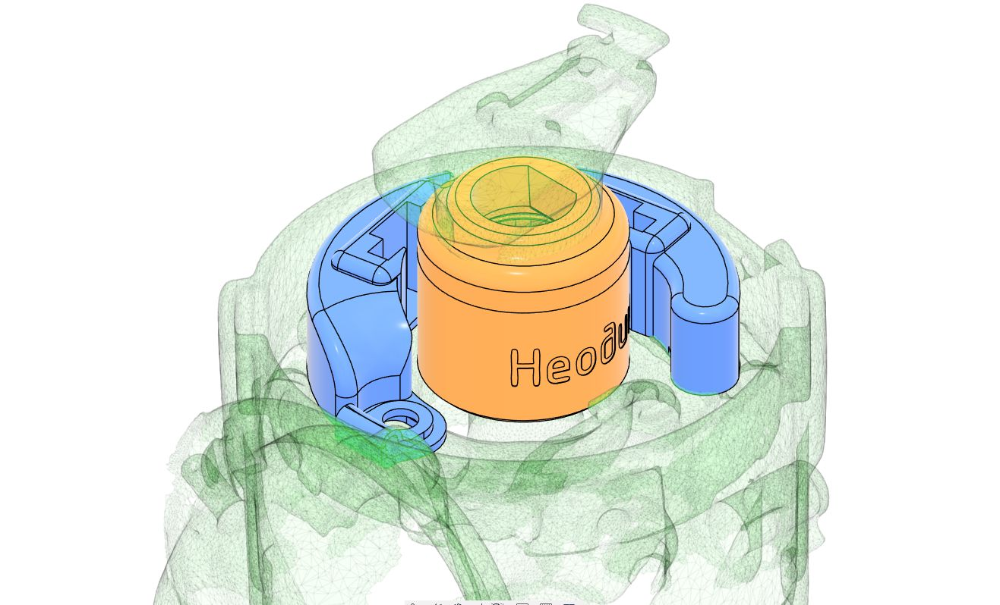
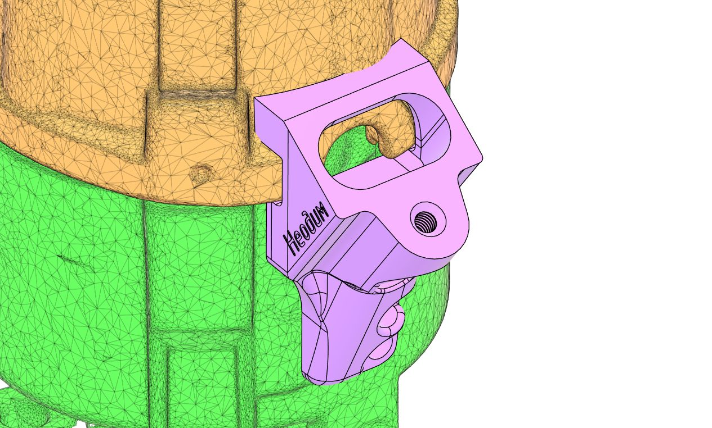

# Иж / Москвич / АЗЛК — комплекты БСЗ Неодим {#kits-izh-moskvich-azlk}

Наборы для трамблёров **Р-147**, **4701.3706**, **4708.3706** (версия **V2 COMBO**). Крышки и датчики общие с линейкой ЗАЗ / ЛуАЗ — см. [ЗАЗ / ЛуАЗ](zaz-luaz.md) (крышка двухконтурного БСЗ, датчики Холла 1 шт. / 2 шт.).

## Одноконтурный комплект V2 COMBO {#kit-single-v2-combo}

{ width="360" }

| Параметр | Значение |
|----------|----------|
| Распределители | Р-147, 4701.3706, 4708.3706 |
| Ozon | [карточка товара](https://ozon.ru/product/2576434959) |
| SKU | **2576434959** |
| Артикул поиска | **[Neodim_bsz_147_r2](https://www.ozon.ru/search/?text=Neodim_bsz_147_r2)** |
| Материал | ABS + ASA+CF |

## Двухконтурный комплект V2 COMBO (без крышки) {#kit-dual-v2-combo-no-cover}

{ width="360" }

| Параметр | Значение |
|----------|----------|
| Распределители | Р-147, 4701.3706, 4708.3706 |
| Ozon | [карточка товара](https://ozon.ru/product/2576374819) |
| SKU | **2576374819** |
| Артикул поиска | **[Neodim_dbsz_147_r2](https://www.ozon.ru/search/?text=Neodim_dbsz_147_r2)** |
| Материал | ABS + ASA+CF |

Крышка — в разделах «Крышка под два разъёма датчиков Холла» и «Крышка CARBON (двухконтурный БСЗ)» на странице [ЗАЗ / ЛуАЗ](zaz-luaz.md).

## Держатель разъёма датчика Холла 2108 {#hall-connector-bracket-2108}

{ width="360" }

| Параметр | Значение |
|----------|----------|
| Назначение | Фиксация разъёма датчика ВАЗ 2108 при одноконтурной переделке Р-147 и аналогов |
| Ozon | [карточка товара](https://ozon.ru/product/2647459372) |
| SKU | **2647459372** |
| Артикул поиска | **[Neodim_147_hldr](https://www.ozon.ru/search/?text=Neodim_147_hldr)** |
| Материал | ABS |

---

## Установка {#installation}

### Новая версия наборов {#kits-new-version}

--8<-- "snippets/vk-install-kits-new.md"

Доработка датчика Холла: [Датчик Холла](../components/hall-sensor.md#vk-hall-sensor-video). Готовые датчики 1 шт. / 2 шт.: [Датчик Холла](../components/hall-sensor.md#neodim-hall-kits).
