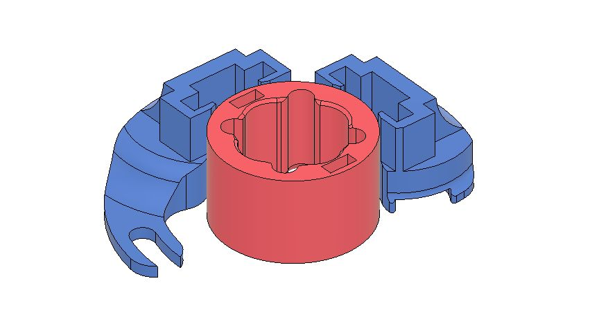
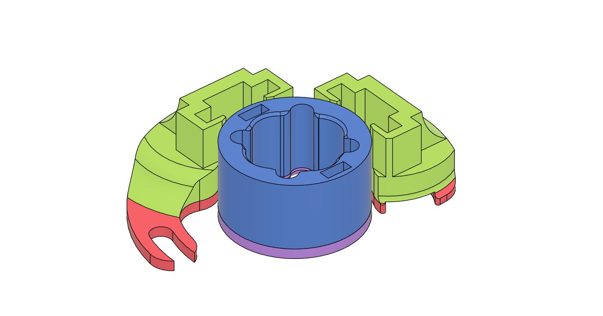
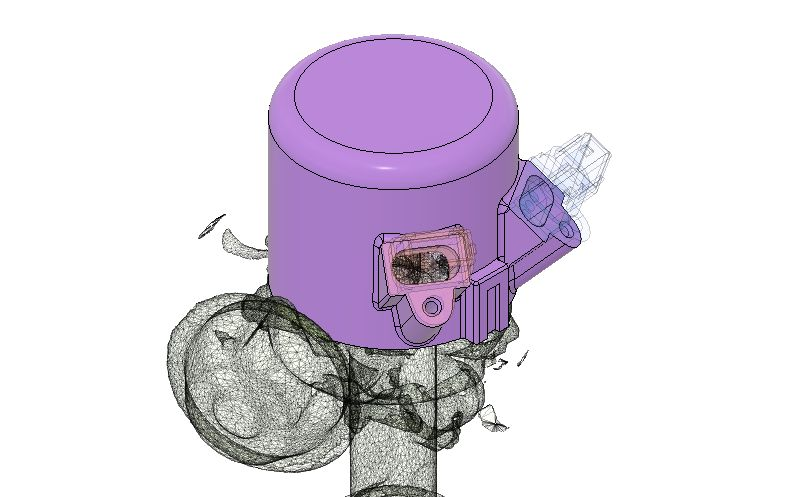
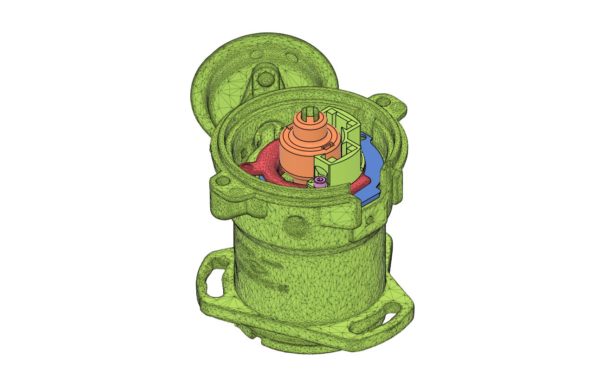
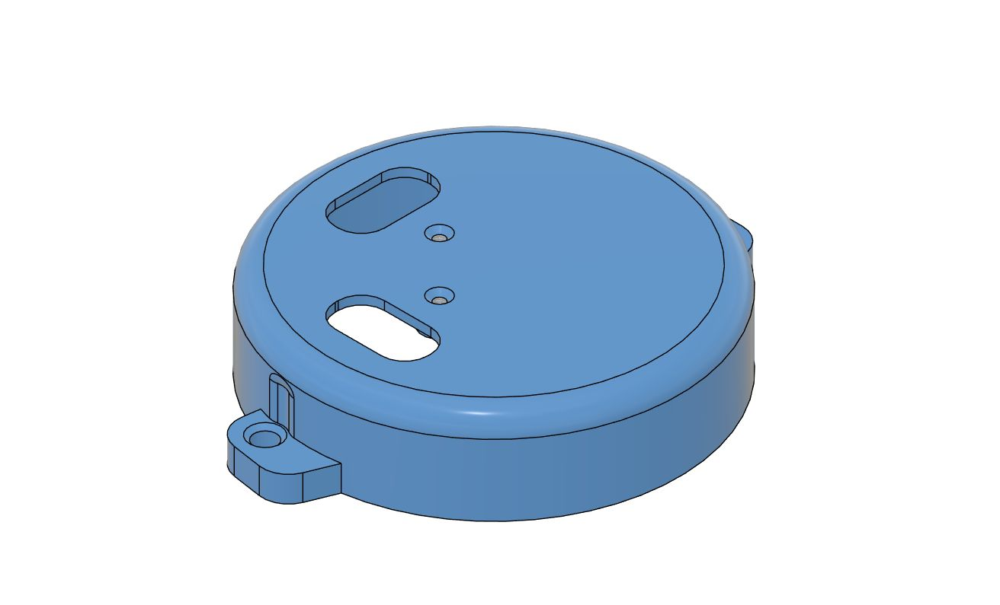

# ВАЗ — комплекты БСЗ Неодим

Двухконтурное (подводное) БСЗ: схема и обоснование — [Двухконтурное БСЗ](../theory/dual-circuit.md).

Крышки и комплекты без крышки продаются отдельно; перед заказом сверьте маркировку трамблёра (30.3706 / 40.3706 и т.д.).

## Трамблёр 30.3706, 3810.3706 (классика 2101–2107)

### Комплект без крышки (стандарт)

{ width="360" }

| Параметр | Значение |
|----------|----------|
| Распределители | 30.3706, 3810.3706 |
| Ozon | [карточка товара](https://ozon.ru/product/1637947194) |
| SKU | **1637947194** |
| Артикул поиска | **[Neodim_dbsz_303706](https://www.ozon.ru/search/?text=Neodim_dbsz_303706)** |
| Материал | ABS |

### Комплект без крышки (COMBO)

{ width="360" }

| Параметр | Значение |
|----------|----------|
| Распределители | 30.3706, 3810.3706 |
| Ozon | [карточка товара](https://ozon.ru/product/1883512879) |
| SKU | **1883512879** |
| Артикул поиска | **[Neodim_dbsz_303706C](https://www.ozon.ru/search/?text=Neodim_dbsz_303706C)** |
| Материал | ABS + ASA+CF |

### Крышка под два разъёма датчиков

{ width="360" }

| Параметр | Значение |
|----------|----------|
| Распределитель | 30.3706 |
| Ozon | [карточка товара](https://ozon.ru/product/1637947676) |
| SKU | **1637947676** |
| Артикул поиска | **[Neodim_cvr_303706](https://www.ozon.ru/search/?text=Neodim_cvr_303706)** |
| Материал | ABS |

## Трамблёр 40.3706 (передний привод)

### Комплект без крышки

{ width="360" }

| Параметр | Значение |
|----------|----------|
| Распределитель | 40.3706 |
| Ozon | [карточка товара](https://ozon.ru/product/1830602234) |
| SKU | **1830602234** |
| Артикул поиска | **[Neodim_dbsz_403706](https://www.ozon.ru/search/?text=Neodim_dbsz_403706)** |
| Материал | ABS |

### Крышка под два разъёма датчиков

{ width="360" }

| Параметр | Значение |
|----------|----------|
| Распределитель | 40.3706 |
| Ozon | [карточка товара](https://ozon.ru/product/1830625050) |
| SKU | **1830625050** |
| Артикул поиска | **[Neodim_cvr_403706](https://www.ozon.ru/search/?text=Neodim_cvr_403706)** |
| Материал | ABS |

---

## Установка

### Трамблёр 30.3706

--8<-- "snippets/vk-install-vaz-303706.md"

### Трамблёр 40.3706

--8<-- "snippets/vk-install-vaz-403706.md"

Доработка датчика Холла: [Датчик Холла](../components/hall-sensor.md#vk-hall-sensor-video).
