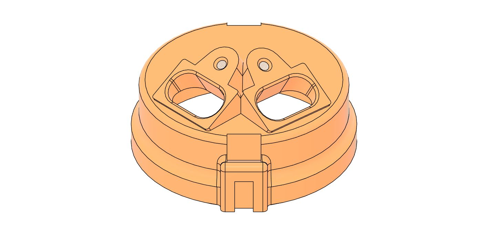

# ЗАЗ / ЛуАЗ — комплекты БСЗ Неодим {#kits-zaz-luaz}

## Одноконтурная система {#single-circuit-system}

Наборы для переделки контактного трамблёра ЗАЗ / ЛуАЗ на БСЗ на базе [датчика Холла](../components/hall-sensor.md) ВАЗ 2108.

Преимущества БСЗ перед КСЗ: [Одноконтурное БСЗ](../theory/single-circuit.md).

### Распределитель старого образца (Р-114) {#distributor-old-r114}

{ width="360" }

| Параметр | Значение |
|----------|----------|
| Распределитель | [Р-107, Р-118, Р-114](../distributors/distributor-r114.md) |
| Ozon | [карточка товара](https://ozon.ru/product/1385734551) |
| SKU | **1385734551** |
| Артикул поиска | **[Neodim_bsz_114](https://www.ozon.ru/search/?text=Neodim_bsz_114)** |
| Версия | **v1.1** |
| Материал | ABS |

### Распределитель нового образца (17.3706) {#distributor-new-173706}

{ width="360" }

| Параметр | Значение |
|----------|----------|
| Распределитель | 17.3706 |
| Ozon | [карточка товара](https://ozon.ru/product/1385734478) |
| SKU | **1385734478** |
| Артикул поиска | **[Neodim_bsz_173706](https://www.ozon.ru/search/?text=Neodim_bsz_173706)** |
| Версия | **v1.1** |
| Материал | ABS |

---

## Двухконтурная система {#dual-circuit-system}

Подробнее: [Двухконтурное БСЗ](../theory/dual-circuit.md).

Двухконтурный комплект сделан только под **17.3706** — логическая замена семейства [Р-114](../distributors/distributor-r114.md) с начала 1980-х.

### Комплект под 17.3706 (двухконтурный) {#kit-dual-173706}

{ width="360" }

| Параметр | Значение |
|----------|----------|
| Распределитель | 17.3706 |
| Ozon | [карточка товара](https://ozon.ru/product/1420395525) |
| SKU | **1420395525** |
| Артикул поиска | **[Neodim_dbsz_173706](https://www.ozon.ru/search/?text=Neodim_dbsz_173706)** |
| Версия | **v1** |
| Материал | ABS |

### Крышка под два разъёма датчиков Холла {#cover-two-hall-connectors}

{ width="360" }

| Параметр | Значение |
|----------|----------|
| Совместимость | ЗАЗ / ЛуАЗ / Иж / АЗЛК / Москвич |
| Ozon | [карточка товара](https://ozon.ru/product/1418835315) |
| SKU | **1418835315** |
| Артикул поиска | **[Neodim_cvr_zaz](https://www.ozon.ru/search/?text=Neodim_cvr_zaz)** |
| Версия | **v1** |
| Материал | ABS |

### Крышка CARBON (двухконтурный БСЗ) {#cover-carbon-dual-circuit}

{ width="360" }

| Параметр | Значение |
|----------|----------|
| Совместимость | ЗАЗ / ЛуАЗ / Иж / АЗЛК / Москвич |
| Ozon | [карточка товара](https://ozon.ru/product/2524236090) |
| SKU | **2524236090** |
| Артикул поиска | **[Neodim_cvr_zaz_crbn](https://www.ozon.ru/search/?text=Neodim_cvr_zaz_crbn)** |
| Материал | ASA+CF |

Два датчика для двухконтурного набора, доработка: [Датчик Холла](../components/hall-sensor.md).

---

## Видео: установка {#video-installation}

### Новая версия наборов {#kits-new-version}

--8<-- "snippets/vk-install-kits-new.md"

### Старая версия наборов {#kits-old-version}

--8<-- "snippets/vk-install-kits-old.md"
