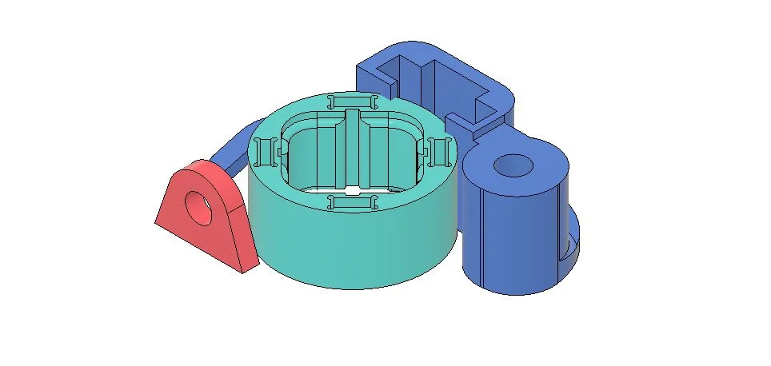
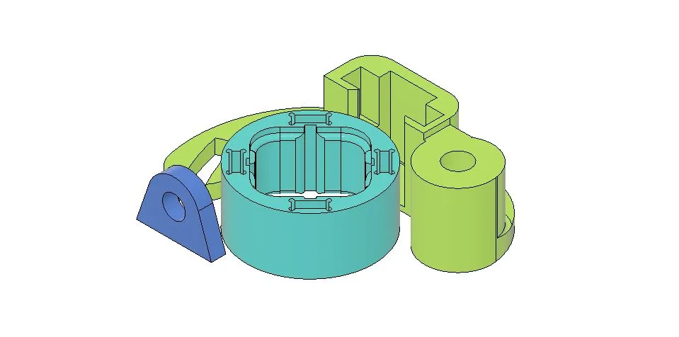
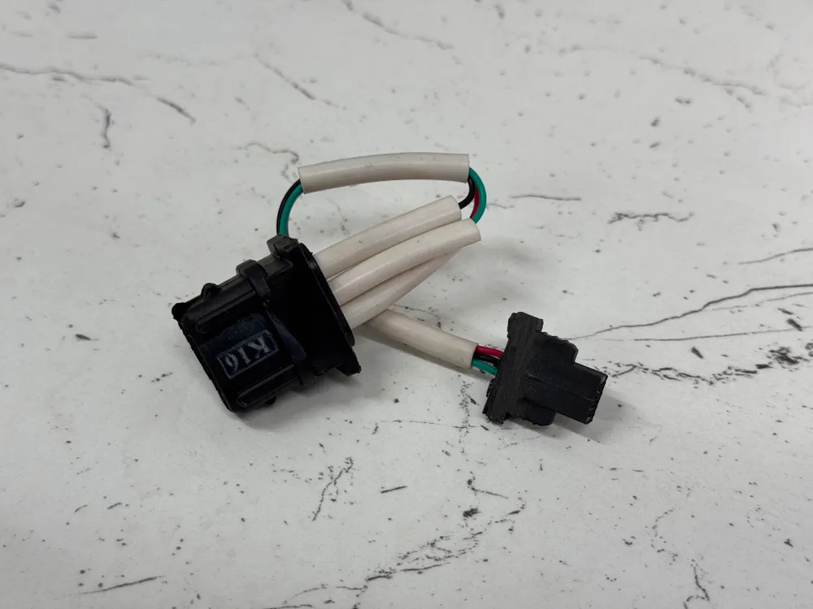
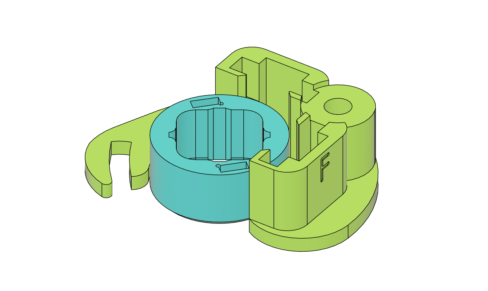
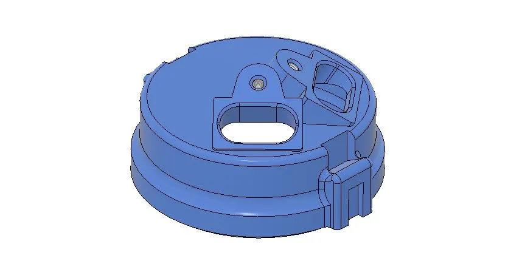

# ЗАЗ / ЛуАЗ — комплекты БСЗ Неодим

## Одноконтурная система

Наборы переводят штатный контактный трамблёр ЗАЗ / ЛуАЗ на БСЗ на базе [датчика Холла](../components/hall-sensor.md) ВАЗ 2108.

Преимущества БСЗ перед КСЗ: [Одноконтурное БСЗ — схема и пояснения](../theory/single-circuit.md).

### Распределитель старого образца (Р-114)

{ width="360" }

| Параметр | Значение |
|----------|----------|
| Распределитель | [Р-114](../components/distributor-r114.md) |
| Ozon | [карточка товара](https://ozon.ru/product/1385734551) |
| Артикул поиска | **[Neodim_bsz_114](https://www.ozon.ru/search/?text=Neodim_bsz_114)** |
| Версия | **v1.1** |
| Материал | ABS |

!!! tip "Версия v1.1"
    Магниты втулки заменены с круглых на прямоугольные: меньше зависимость от высоты чувствительной зоны датчика, проще высота втулки; больше сила поля — можно увеличить зазор без потери стабильности.

### Распределитель нового образца (17.3706)

{ width="360" }

| Параметр | Значение |
|----------|----------|
| Распределитель | 17.3706 |
| Ozon | [карточка товара](https://ozon.ru/product/1385734478) |
| Артикул поиска | **[Neodim_bsz_173706](https://www.ozon.ru/search/?text=Neodim_bsz_173706)** |
| Версия | **v1.1** |
| Материал | ABS |

!!! tip "Версия v1.1"
    Переход на прямоугольные магниты — как у комплекта под Р-114.

### Датчик Холла к одноконтурному набору

{ width="360" }

| Параметр | Значение |
|----------|----------|
| Совместимость | ЗАЗ / ЛуАЗ / Иж / АЗЛК / Москвич |
| Ozon | [готовый датчик](https://ozon.ru/product/1896862674) |
| Артикул поиска | **[Neodim_hs_1](https://www.ozon.ru/search/?text=Neodim_hs_1)** |
| База | А473.407529.002 |

Готовый доработанный датчик — в [магазине на Ozon](https://ozon.ru/product/1896862674); либо любой магазинный [датчик Холла](../components/hall-sensor.md) и доработка по видео ниже.

#### Видео: доработка датчика Холла

--8<-- "snippets/vk-hall-sensor-mod.md"

---

## Двухконтурная система

Схема и плюсы: [Двухконтурное БСЗ](../theory/dual-circuit.md).

Двухконтурный комплект только под **17.3706** — логическая замена [Р-114](../components/distributor-r114.md) с начала 1980-х.

### Комплект под 17.3706 (двухконтурный)

{ width="360" }

| Параметр | Значение |
|----------|----------|
| Распределитель | 17.3706 |
| Ozon | [карточка товара](https://ozon.ru/product/1420395525) |
| Артикул поиска | **[Neodim_dbsz_173706](https://www.ozon.ru/search/?text=Neodim_dbsz_173706)** |
| Версия | **v1** |
| Материал | ABS |

!!! tip "Версия v1"
    Сразу заложен опыт предыдущих наборов — прямоугольные магниты.

### Крышка под два разъёма датчиков Холла

{ width="360" }

| Параметр | Значение |
|----------|----------|
| Совместимость | ЗАЗ / ЛуАЗ / Иж / АЗЛК / Москвич |
| Ozon | [карточка товара](https://ozon.ru/product/1418835315) |
| Артикул поиска | **[Neodim_cvr_zaz](https://www.ozon.ru/search/?text=Neodim_cvr_zaz)** |
| Версия | **v1** |
| Материал | ABS |

### Датчики Холла к двухконтурному набору (2 шт.)

{ width="360" }

| Параметр | Значение |
|----------|----------|
| Совместимость | ЗАЗ / ЛуАЗ / Иж / АЗЛК / Москвич |
| Ozon | [готовые датчики, 2 шт.](https://ozon.ru/product/1896873304) |
| Артикул поиска | **[Neodim_hs_2](https://www.ozon.ru/search/?text=Neodim_hs_2)** |
| База | А473.407529.002 |

Или два магазинных [датчика Холла](../components/hall-sensor.md) и доработка — см. видео в разделе одноконтурного набора выше.

---

## Сообщество

--8<-- "snippets/telegram-bsz.md"

## Видео: установка

### Новая версия наборов

--8<-- "snippets/vk-install-kits-new.md"

### Старая версия наборов

--8<-- "snippets/vk-install-kits-old.md"
