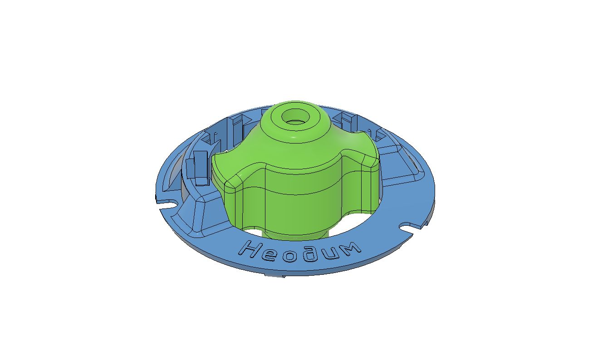
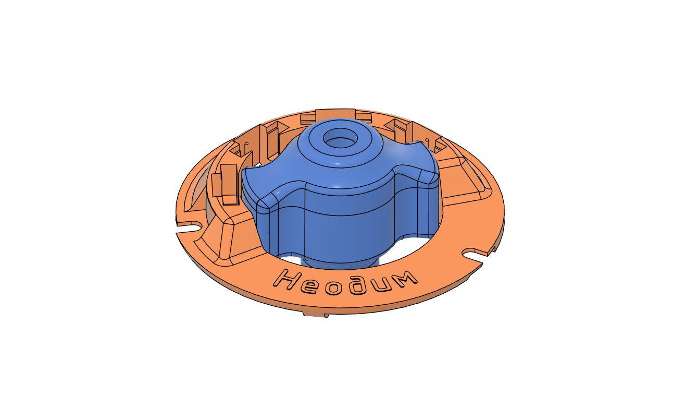
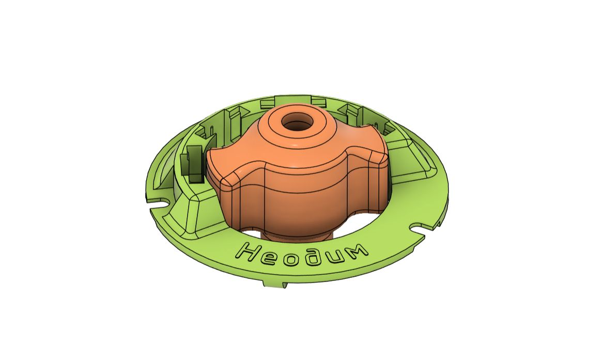
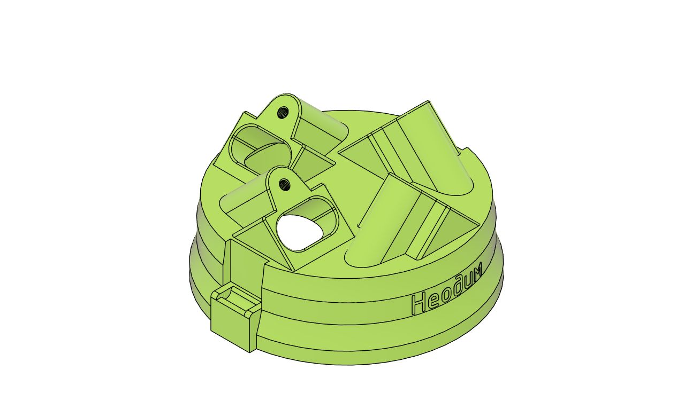
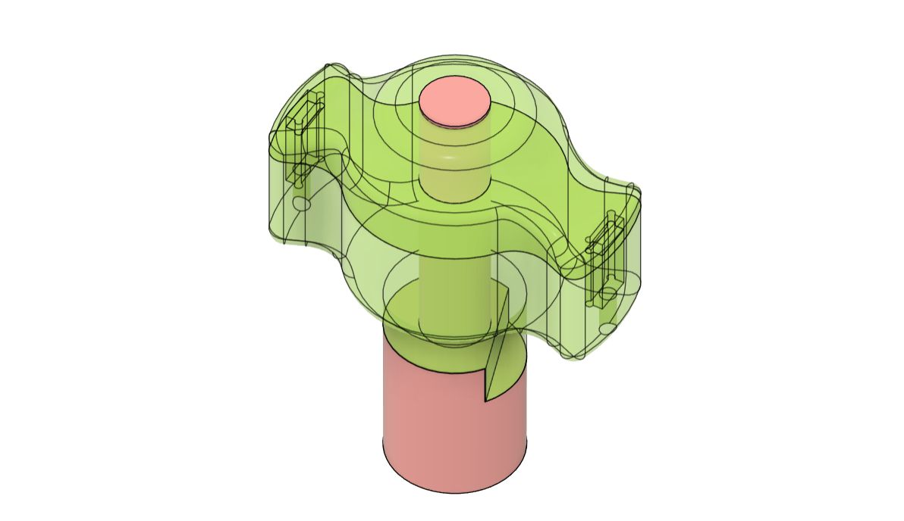
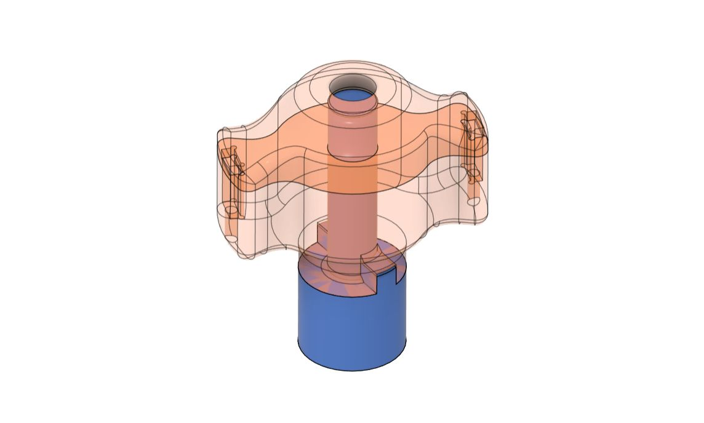

# ЗИЛ / ГАЗ (V8) — комплекты БСЗ Неодим {#kits-zil-gaz-v8}

Четырёхконтурное (подводное) зажигание: [Четырёхконтурное БСЗ](guide/schemes/four-circuit.md).

Комплекты рассчитаны на распределители **24.3706**, **2402.3706**, **2402.3706-10** и аналоги; крышки и втулки уточняйте по маркировке и типу вала (старый / новый образец).

## Комплект без крышки — 24.3706 (ЗИЛ 130) {#kit-no-cover-243706-zil130}

{ width="360" }

| Параметр | Значение |
|----------|----------|
| Распределители | 24.3706, 24.3706а |
| Ozon | [карточка товара](https://ozon.ru/product/1867199126) |
| SKU | **1867199126** |
| Артикул поиска | **[Neodim_qbsz_243706](https://www.ozon.ru/search/?text=Neodim_qbsz_243706)** |
| Материал | ABS + композит с карбоном (Combo) |

## Комплект без крышки — 2402.3706-10 (ЗИЛ / ГАЗ / ПАЗ) {#kit-no-cover-2402-10}

{ width="360" }

| Параметр | Значение |
|----------|----------|
| Распределители | 2402.3706, 2402.3706-10 |
| Ozon | [карточка товара](https://ozon.ru/product/1875698543) |
| SKU | **1875698543** |
| Артикул поиска | **[Neodim_qbsz_2402370610](https://www.ozon.ru/search/?text=Neodim_qbsz_2402370610)** |
| Материал | ABS + композит с карбоном (Combo) |

## Комплект без крышки — 2402.3706 старого образца (вал с лыской) {#kit-no-cover-2402-old-shaft}

{ width="360" }

| Параметр | Значение |
|----------|----------|
| Распределители | 2402.3706 / 24.3706 **старого** образца (вал с лыской) |
| Ozon | [карточка товара](https://ozon.ru/product/3404118730) |
| SKU | **3404118730** |
| Артикул поиска | **[Neodim_qbsz_24023706_old](https://www.ozon.ru/search/?text=Neodim_qbsz_24023706_old)** |
| Материал | ABS + композит с карбоном (Combo) |

## Крышка v2 (четырёхконтурный БСЗ) {#cover-v2-four-circuit}

{ width="360" }

| Параметр | Значение |
|----------|----------|
| Распределители | 2402.3706, 2402.3706-10, 24.3706, Р133-01 |
| Ozon | [карточка товара](https://ozon.ru/product/2200223363) |
| SKU | **2200223363** |
| Артикул поиска | **[Neodim_qbsz_cvr_v2](https://www.ozon.ru/search/?text=Neodim_qbsz_cvr_v2)** |
| Материал | ABS |

---

## Отдельные втулки под разный тип вала {#bushings-shaft-type}

!!! question "Зачем нужны отдельные втулки?"
    Отдельные втулки нужны только если у вас сломалась или не подошла втулка из комплекта.

### Старый вал (лыска) {#shaft-old-key-flat}

{ width="360" }

| Параметр | Значение |
|----------|----------|
| Совместимость | 24.3706, 2402.3706 — вал с лыской |
| Ozon | [карточка товара](https://ozon.ru/product/3241535831) |
| SKU | **3241535831** |
| Артикул поиска | **[Neodim_qbsz_vtul_01](https://www.ozon.ru/search/?text=Neodim_qbsz_vtul_01)** |

### Новый вал (выступ) {#shaft-new-tab}

{ width="360" }

| Параметр | Значение |
|----------|----------|
| Совместимость | 24.3706, 2402.3706 — вал с выступом (обычно после 2000-х) |
| Ozon | [карточка товара](https://ozon.ru/product/3404112895) |
| SKU | **3404112895** |
| Артикул поиска | **[Neodim_qbsz_vtul_02](https://www.ozon.ru/search/?text=Neodim_qbsz_vtul_02)** |

---

## Установка {#installation}

--8<-- "snippets/vk-install-zil-v8.md"

### Доработка датчика Холла {#video-hall-sensor-mod}

--8<-- "snippets/vk-hall-sensor-mod.md"

[Датчик Холла](components/hall-sensor.md#vk-hall-sensor-video) · [инструкция](guide/hall-sensor-mod.md)

## Смотрите также {#see-also}

- [Распределители 24.3706](distributors/distributor-243706.md) · [2402.3706](distributors/distributor-2402.md) · [Р133-01](distributors/distributor-r133-01.md).
- [Четырёхконтурное БСЗ](guide/schemes/four-circuit.md) — принципиальная схема для V8.
- [Типовой список компонентов → четырёхконтурная система](components/buy-list.md#parts-four-circuit).
- [Руководство → Сборка системы по схеме](guide/build-circuit.md).
- [Видео-архив](videos/index.md).
