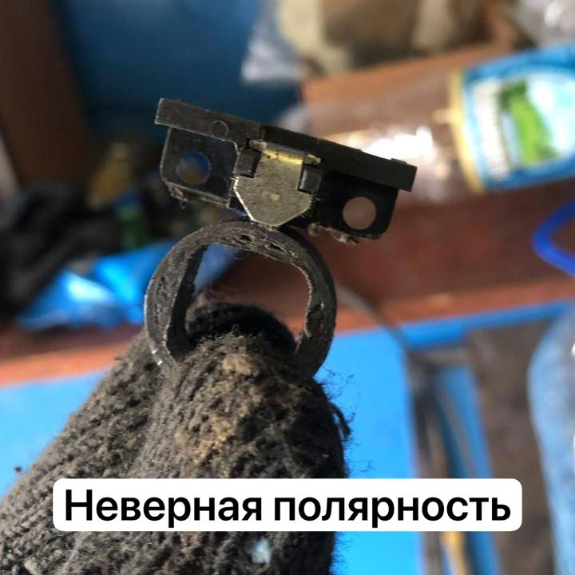
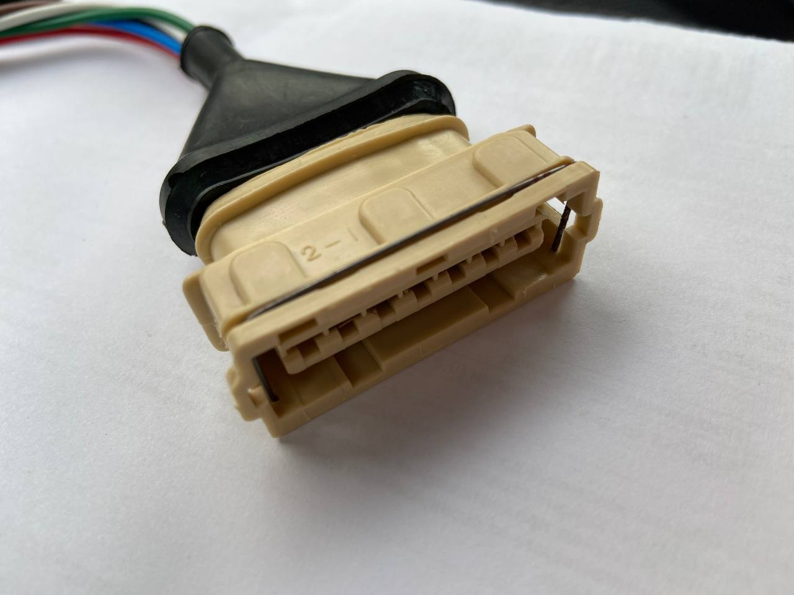

# Алгоритм проверки БСЗ {#bsz-check-algorithm}

!!! danger "Безопасность при проверке искры"
    Зазор между центральным бронепроводом и массой при проверке **без свечи** держите **до ~1,5 мм**; используйте изолирующие перчатки.

    **Предпочтительно:** свеча на центральном проводе катушки и надёжный контакт корпуса свечи с массой двигателя и АКБ.

## Быстрая проверка датчика Холла {#quick-hall-sensor-test}

1. Включите зажигание, двигатель не запускайте.
2. Подготовьте контроль искры: либо конец центрального провода у массы с небольшим зазором, либо свеча на массе.
3. Поднесите магнит (с доработанного датчика или втулку набора) к рабочей стороне датчика.  
   Искра должна появляться при **правильной** полярности магнита. Нет искры — переверните магнит и повторите.

!!! note "Полярность и втулка"
    Если искра есть только при «не той» стороне магнита, проверьте отталкивание от втулки. Притягивается к втулке — возможно, нужно перевернуть магниты во втулке (см. ниже) или используется датчик обратной полярности.

## Проверка полярности магнитов во втулке {#bushing-magnet-polarity-check}

{ width="420" }

Поднесите отпиленный магнит с датчика к **внешней** стороне втулки:

| Ситуация | Значение |
|----------|----------|
| Магнит **отталкивается** | Полярность «прямая», ожидаемая для большинства комплектов |
| Магнит **притягивается** | Нужно развернуть магниты во втулке или подобрать датчик |

Без родного магнита с датчика возьмите любой неодимовый, отметьте сторону, которая **отталкивается** от втулки — это и есть **прямая** полярность для проверок.

**Нет искры при любой полярности** — возможны:

- неисправный [датчик Холла](../components/hall-sensor.md) (частый случай);
- всё ещё неверная полярность / перевёрнут один из магнитов на втулке;
- коммутатор, проводка, катушка.

## Проверка коммутатора {#commutator-check}

1. В разъём датчика вставьте провод в **средний (сигнальный)** контакт.
2. Центральный ВВ-провод — к массе с небольшим зазором **или** свеча на массе.
3. Замкните сигнальный провод датчика на массу двигателя.

| Результат | Вывод |
|-----------|--------|
| Искра есть | Цепь коммутатора и первичка живы; подозревать датчик или его разводку |
| Искры нет | Проверить коммутатор, разъёмы и обжим пинов, катушку, полное соответствие схеме, затем снова датчик |

**Дополнительно:**

- проверьте **все** магниты на втулке (на одном цилиндре нет искры — возможен один перевёрнутый сегмент);
- датчики ООО «РОМБ» нередко «обратные» — либо замена, либо согласование магнитов втулки; родной отпиленный магнит должен **отталкиваться** от каждого сегмента втулки.

## Жгуты и разъёмы ВАЗ 2105 / 2121 {#vaz-2105-2121-harness-connectors}

{ width="420" }

Частая проблема — **плохо обжатые пины**: провод выпадает, контакт «плавает». На силовых линиях (например 2-й пин — масса, 4-й — питание коммутатора) возможен нагрев, оплавление колодки, почернение контактов.

Перед установкой проверьте обжим и плотность посадки пинов; при необходимости — пережать или допаять.

## Типичные неисправности {#typical-faults}

- бракованные новые датчики сериями — брать у проверенных продавцов, см. [рекомендации по датчику](../components/hall-sensor.md);
- неверная полярность магнитов / датчик «РОМБ» без переворота магнитов;
- плохие контакты в разъёмах, заломы жгута, окисление;
- отказ датчика через несколько секунд после запуска (брак).
