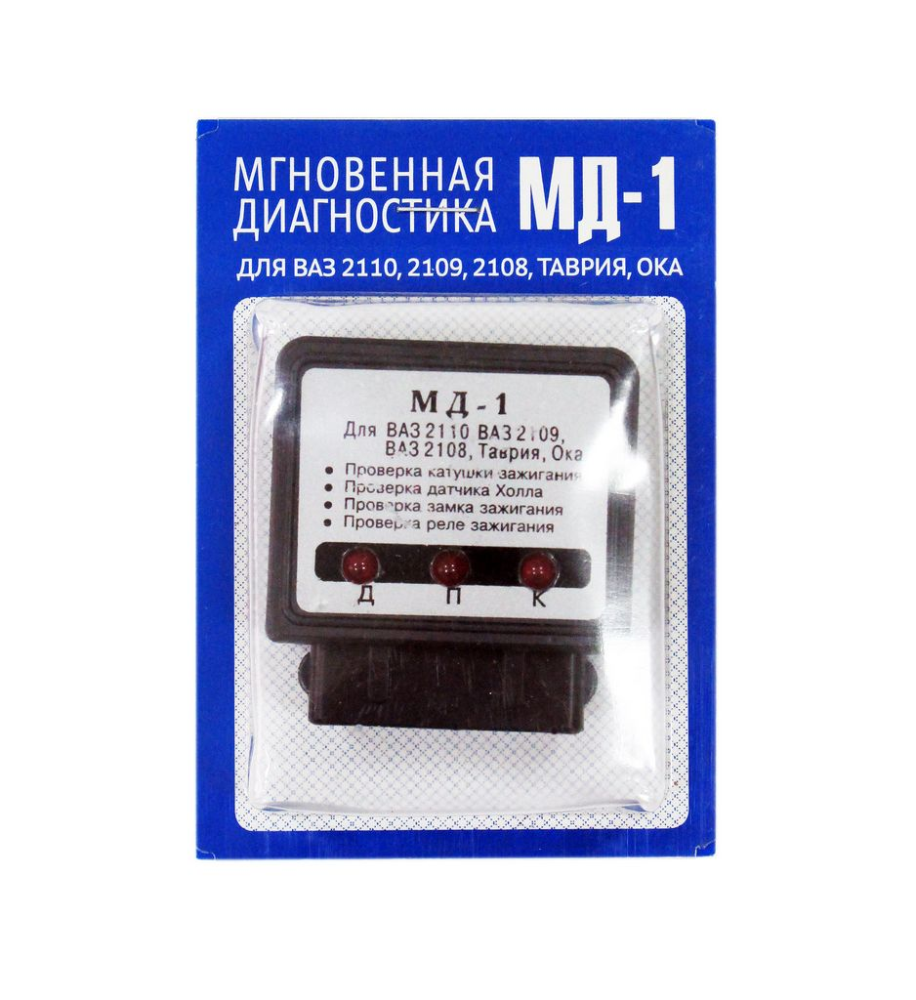

# Настройка момента зажигания

Инструкция после установки БСЗ комплекта Неодим с использованием [МД-1](../components/md-1.md).

{ width="400" }

## 1. Подготовка

- Временно вместо штатного **коммутатора** установите [МД-1](../components/md-1.md).
- Либо подключите **мультиметр** к **среднему** выводу [датчика Холла](../components/hall-sensor.md).

## 2. ВМТ 1-го цилиндра, такт сжатия

- Проверните коленвал так, чтобы **1-й цилиндр** был в **ВМТ такта сжатия** (оба клапана закрыты).

!!! note "Метка МЗ"
    На части моторов перед ВМТ есть метка **МЗ** (зажигание на холостом ходу). Выставьте по МЗ и убедитесь, что это именно **сжатие**, а не выпуск.

В этом положении в конце настройки должна формироваться искра.

## 3. Момент искрообразования

- Медленно вращайте **трамблёр** вручную.
- Как только на МД-1 загорится нужный индикатор (**«Д»**) — зафиксируйте положение корпуса распределителя.

## 4. Бегунок и порядок проводов

- Снимите крышку; бегунок должен смотреть на **контакт 1-го цилиндра**.
- Иначе переставьте высоковольтные провода с учётом порядка работы и направления вращения трамблёра.

## 5. Завершение

- Двигатель должен **запуститься**.
- Точный **УОЗ** после прогрева — **стробоскопом**, либо осторожно по нагрузке и детонации.

!!! warning "Детонация"
    «Грохот клапанов» — слишком раннее зажигание; сместите позже до устойчивой работы без детонации.

Если не заводится — проверьте разводку датчика и целостность цепи; см. [алгоритм проверки БСЗ](bsz-check-algorithm.md).
