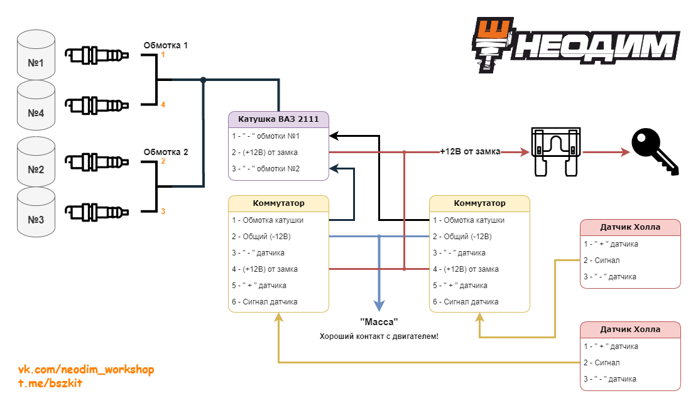

# Двухконтурное БСЗ

Типовая схема двухконтурной бесконтактной системы зажигания.

{ width="720" }

*Типовая схема двухконтурного БСЗ.*

## Преимущества

Помимо плюсов [обычной одноконтурной БСЗ](single-circuit.md):

1. **Высокое напряжение не идёт через трамблёр** — нет бегунка и крышки во ВВ-цепи.
2. **Два независимых контура:** первый — цилиндры 1 и 4, второй — 2 и 3.
3. Бронепровод идёт к свечам напрямую — меньше механических потерь и «задувания» искры на высоких оборотах.

При отказе одного датчика Холла или одного из двух коммутаторов остаётся работающая пара цилиндров — в одноконтурной схеме это полный останов. Да, мощность падает, но в экстренной ситуации можно завести мотор на двух цилиндрах или доехать до помощи.

Комплекты Неодим проектируются под массовые отечественные компоненты: их проще найти в дороге и отремонтировать систему щетиной.

## Недостатки

Выше стоимость и состав корзины по сравнению с одноконтурной схемой:

- два коммутатора и два датчика Холла;
- два жгута БСЗ (ВАЗ 2105 или 2121) вместо одного;
- модуль зажигания ВАЗ 2111 (по цене сопоставим с обычной катушкой) и разъём к нему.

Вложения разовые; дальше чаще всего меняют только датчики Холла, реже коммутаторы. Качественные детали снижают риск отказов.

## Список компонентов

Рекомендуем собрать недостающее на [Ozon](https://www.ozon.ru/).

??? info "Развёрнутый перечень для корзины"

    1. [Датчик Холла АО «Автоэлектроника»](../components/hall-sensor.md) **А473.407529.002** — **2 шт.**  
       Готовые доработанные: [Ozon](https://ozon.ru/product/1896873304), магазин [Неодим](https://www.ozon.ru/seller/neodim-1649379/).
    2. [Коммутатор 76.3774](../components/commutator-763774.md) — **2 шт.**
    3. Модуль зажигания ВАЗ 2111 **2111-3705010-03** — **1 шт.**  
       - разъём 3 контакта **ДАП-107.3724.030-01** — 1 шт.  
       - либо **две** катушки ЗМЗ 406 **406.3705**
    4. Жгут ВАЗ 2105 **2105-3724026-20** — **2 шт.**  
       - либо жгут ВАЗ 2121 **2121-3724026** (длиннее) — 2 шт.
    5. Комплект бронепроводов инжекторного ВАЗ 2107 / 2112 — 1 комплект  
       - при проводах «нулевого сопротивления» свечи должны быть с встроенным резистором (часто маркировка **R**);  
       - к модулю 2111 нужны посадочные места под инжекторные провода.
    6. Комплект Неодим под ваш трамблёр:  
       - [ЗАЗ / ЛуАЗ](../kits/zaz-luaz.md)  
       - [Иж / АЗЛК / Москвич](../kits/izh-moskvich-azlk.md)  
       - [ГАЗ / УАЗ](../kits/gaz-uaz.md)  
       - [V8 ЗИЛ / ГАЗ](../kits/zil-gaz-v8.md)
    7. Крышка с креплением двух разъёмов датчиков Холла ВАЗ 2108 (опционально) — многие дорабатывают штатную крышку.

## Тахометр

У штатного прибора обычно один вход импульсов, а коммутация идёт через **два** коммутатора. Схема сводки сигнала на вход тахометра (диоды, при необходимости — резисторы) — в статье [Подключение тахометра (два контура)](../instructions/video-tachometer-connection.md).
