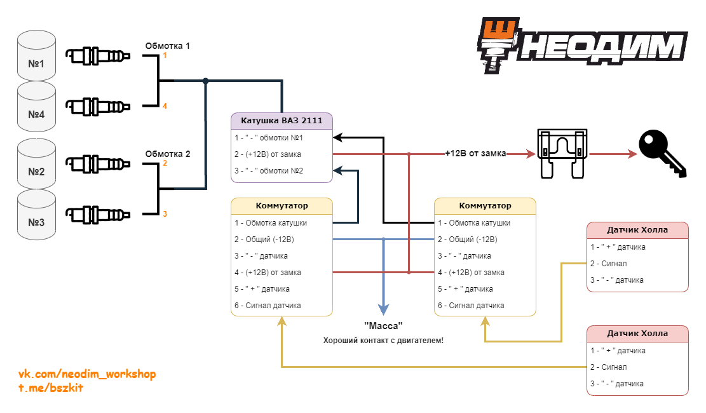

# Двухконтурное БСЗ {#dual-circuit-bsz}

Типовая схема двухконтурной бесконтактной системы зажигания.

{ width="720" }

*Типовая схема двухконтурного БСЗ.*

## Преимущества {#advantages}

Помимо плюсов [обычной одноконтурной БСЗ](single-circuit.md):

1. **Высокое напряжение не идёт через трамблёр** — нет бегунка и крышки во ВВ-цепи.
2. **Два независимых контура:** первый — цилиндры 1 и 4, второй — 2 и 3.
3. Бронепровод идёт к свечам напрямую — меньше механических потерь и «задувания» искры на высоких оборотах.

При отказе одного датчика Холла или одного из двух коммутаторов остаётся работающая пара цилиндров — в одноконтурной схеме это полный останов. Да, мощность падает, но в экстренной ситуации можно завести мотор на двух цилиндрах или доехать до помощи.

Комплекты Неодим проектируются под массовые отечественные компоненты: их проще найти в дороге и отремонтировать систему щетиной.

## Пары цилиндров и какой датчик к какому контуру {#cylinder-pairs-hall-mapping}

У рядного четырёхцилиндрового двигателя с обычным порядком работы цилиндров пары для схемы с [«холостой» искрой](../index.md#dual-circuit-idle-spark) всегда **1+4** и **2+3**.

На каждую пару приходится **одна** первичная цепь: одна обмотка в составе [модуля 2111](../components/ignition-coils.md#coils-dual-circuit) или отдельная [катушка ЗМЗ 406](../components/ignition-coils.md#coils-dual-circuit), [**один** коммутатор](../components/commutator-763774.md) и [**один** датчик Холла](../components/hall-sensor.md). 
Импульс с того датчика, на который в нужный момент смотрит магнит на втулке, — задаёт момент искрообразования для этой цепи.

Выставьте [**ВМТ**](../guide/ignition-timing.md#step-2-tdc-compression) и такт сжатия (см. [настройку момента зажигания](../guide/ignition-timing.md)), снимите крышку трамблёра и посмотрите, **на какой из двух** [датчиков Холла](../components/hall-sensor.md#dual-circuit-kit-two-sensors) направлен магнит — этот датчик отвечает за пару **1+4**. Второй датчик подключите к [коммутатору](../components/commutator-763774.md) для пары **2+3**.

!!! note "Два контура — две цепи"
    Перепутать датчики между коммутаторами нельзя: каждый контур должен получать импульсы от «своего» датчика. См. также [двухконтурное зажигание: рассинхрон](../guide/problems-and-solutions.md#dual-circuit-desync).

## Недостатки {#disadvantages}

Выше стоимость и состав корзины по сравнению с одноконтурной схемой:

- два коммутатора и два датчика Холла;
- два жгута БСЗ (ВАЗ 2105 или 2121) вместо одного;
- модуль зажигания ВАЗ 2111 (по цене сопоставим с обычной катушкой) и разъём к нему.

Вложения разовые; дальше чаще всего меняют только датчики Холла, реже коммутаторы. Качественные детали снижают риск отказов.

## Список компонентов {#parts-list}

Рекомендуем собрать недостающее на [Ozon](https://www.ozon.ru/).

!!! info "Развёрнутый перечень для корзины"

    1. [Датчик Холла АО «Автоэлектроника» от ВАЗ 2108](../components/hall-sensor.md) **А473.407529.002** — **2 шт.**  
       Готовые доработанные: [Ozon](https://ozon.ru/product/1896873304), магазин [Неодим](https://www.ozon.ru/seller/neodim-1649379/).
    2. [Коммутатор 76.3774 РОМБ](../components/commutator-763774.md) — **2 шт.**
    3. Модуль зажигания ВАЗ 2111 **2111-3705010-03** — **1 шт.**  
       Разъём на 3 контакта **ДАП-107.3724.030-01** — 1 шт.  
       (Либо **две** катушки ЗМЗ 406 **406.3705**)
    4. Жгут ВАЗ 2105 **2105-3724026-20** — **2 шт.**  
       Либо жгут ВАЗ 2121 **2121-3724026** (длиннее) — 2 шт.
    5. Комплект бронепроводов от инжекторного ВАЗ 2107 / 2112 — 1 комплект  
       При проводах «нулевого сопротивления» свечи должны быть со встроенным резистором (часто маркировка **R**);  
       К модулю 2111 нужны инжекторные бронепровода.
    6. [Комплект Неодим](../kits/how-to-choose-kit.md) под ваш трамблёр: 
    7. Крышка с креплением двух разъёмов датчиков Холла ВАЗ 2108 (опционально).

## Тахометр {#tachometer}

У штатного тахометра обычно один вход импульсов, а коммутация идёт через **два** коммутатора. Нельзя объединять два контура без диодов.

Схема подключения на вход тахометра (диоды, при необходимости — резисторы) — в статье [Подключение тахометра (два контура)](../guide/tachometer-connection.md).

Для **шестицилиндровых** моторов та же идея масштабируется до **трёх** контуров (три пары цилиндров) — см. [трёхконтурное БСЗ](three-circuit.md).

## Смотрите также {#see-also}

- [Одноконтурное БСЗ](single-circuit.md) · [Трёхконтурное БСЗ](three-circuit.md) · [Четырёхконтурное БСЗ](four-circuit.md).
- [Руководство → Подключение тахометра](../guide/tachometer-connection.md) · [Сборка системы](../guide/build-circuit.md).
- [Типовой список компонентов → двухконтурная система](../components/buy-list.md#parts-dual-circuit).
- [Датчик Холла](../components/hall-sensor.md) · [Коммутатор 76.3774](../components/commutator-763774.md) · [Жгут проводки БСЗ](../components/wiring-harness-dbsz.md).
- [Проблемы и решения → Двухконтурное: рассинхрон](../guide/problems-and-solutions.md#dual-circuit-desync).
