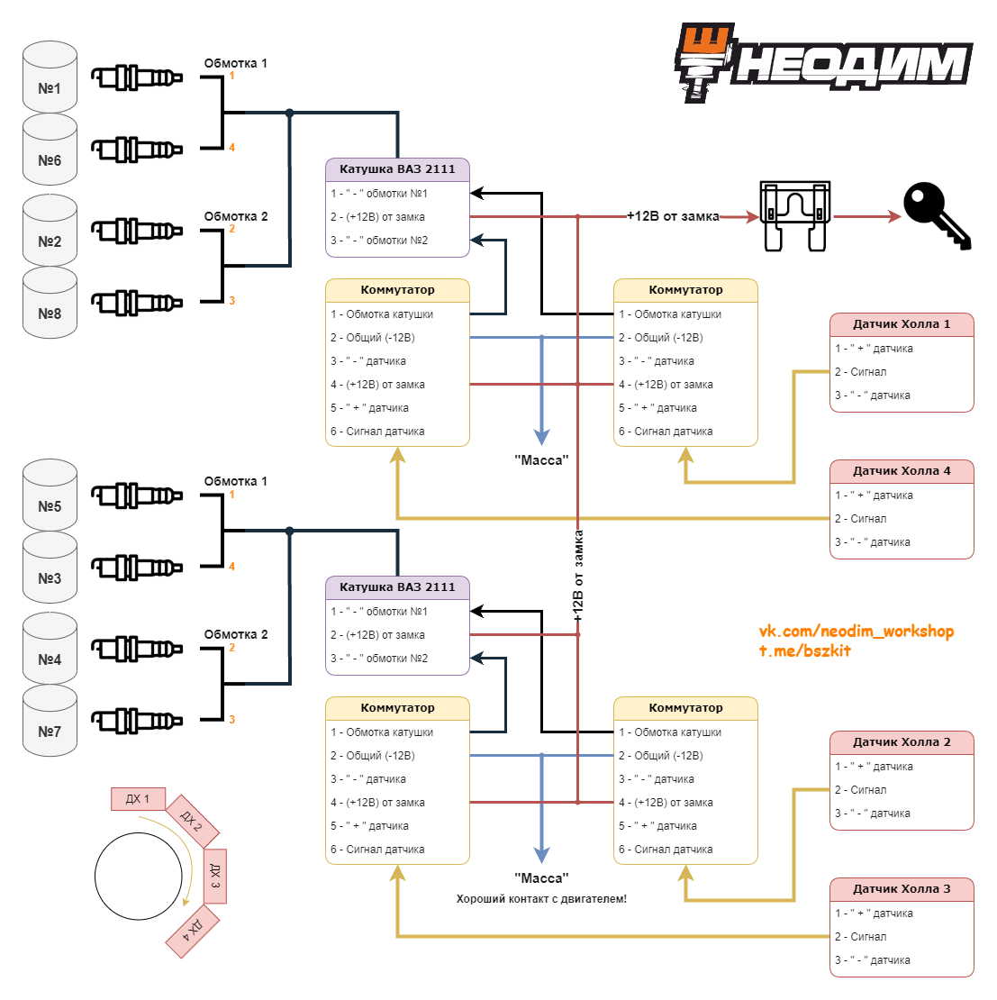

# Четырёхконтурное бесконтактное зажигание

Четыре независимых контура для восьмицилиндровых двигателей работают по тому же принципу, что и [двухконтурная система с холостой искрой](dual-circuit.md): на каждую пару цилиндров один контур (рабочая и «холостая» искра).

Коммутатор [76.3774](../components/commutator-763774.md) — одноканальный; для четырёх контуров используются четыре коммутатора (или согласованное решение по вашей схеме). Наборы: [ЗИЛ / ГАЗ V8](../kits/zil-gaz-v8.md).

## Типовая схема

{ width="720" }

*Типовая схема четырёхконтурного БСЗ.*
