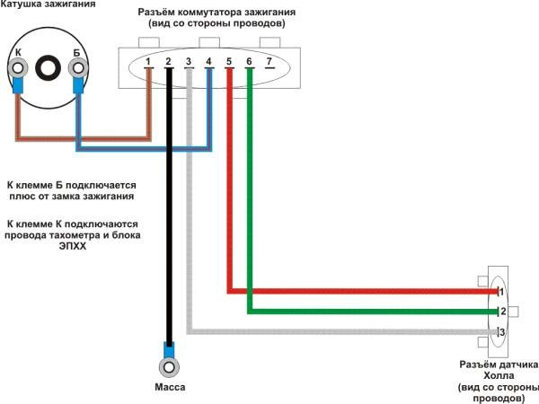

# Одноконтурное БСЗ

Ниже — типовая схема одноконтурной бесконтактной системы зажигания.

{ width="720" }

*Типовая схема стандартного БСЗ.*

## Преимущества перед КСЗ

1. Нет контактной пары в трамблёре — не нужны регулярная чистка нагара и подгонка зазора щупами.
2. **Стабильность:** у БСЗ порог датчика Холла постоянен; на высоких оборотах у КСЗ пружина контактов не всегда успевает.
3. **Низкое сервисное бремя** — без ритуала с контактами и зазорами.
4. Датчик Холла не реагирует на воду, пыль и другие немагнитные среды в обычных условиях.
5. **Меньше потерь:** в КСЗ часть энергии уходит в контакты; датчик Холла только даёт логический сигнал коммутатору, высоковольтную мощность не несёт.
6. Нет искрения на контактах — меньше помех для радио и чувствительной электроники.

Современный [коммутатор 76.3774](../components/commutator-763774.md) в связке с БСЗ помогает стабильно заряжать катушку при меняющемся напряжении бортсети и оборотах.

!!! tip "Зажигание оставили включённым"
    У многих коммутаторов есть защита: без импульсов с датчика ток в первичке не держится — катушка не перегреется. На КСЗ при замкнутых контактах и включённом зажигании обмотка может быстро выйти из строя.

## Недостатки

- Качество недорогих датчиков и коммутаторов бывает низким; проблема решается проверенными производителями.
- Электроника со временем может отказать (температура, ключи). В одноконтурной схеме один датчик и один коммутатор — отказ любого из них не даст запустить мотор.

Имеет смысл иметь запасной датчик и/или коммутатор; чаще выходит из строя датчик Холла, реже коммутатор, ещё реже катушка.

## Альтернатива — двухконтурная схема

Надёжность повышает [двухконтурная система](dual-circuit.md) (т.н. [wasted spark](https://en.wikipedia.org/wiki/Wasted_spark_system)): фактически два одноконтурных канала — 1–4 и 2–3 цилиндры.

Для восьми цилиндров см. [четыре контура](four-circuit.md).
